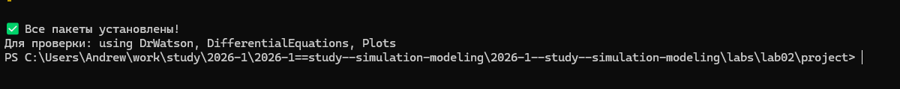
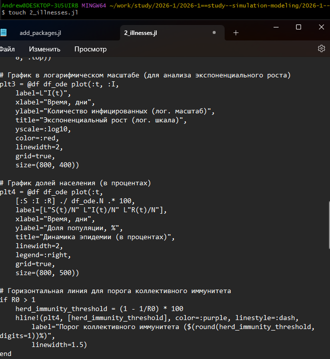
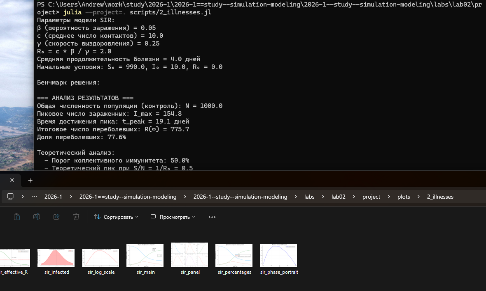
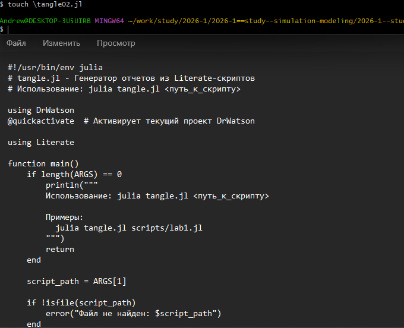
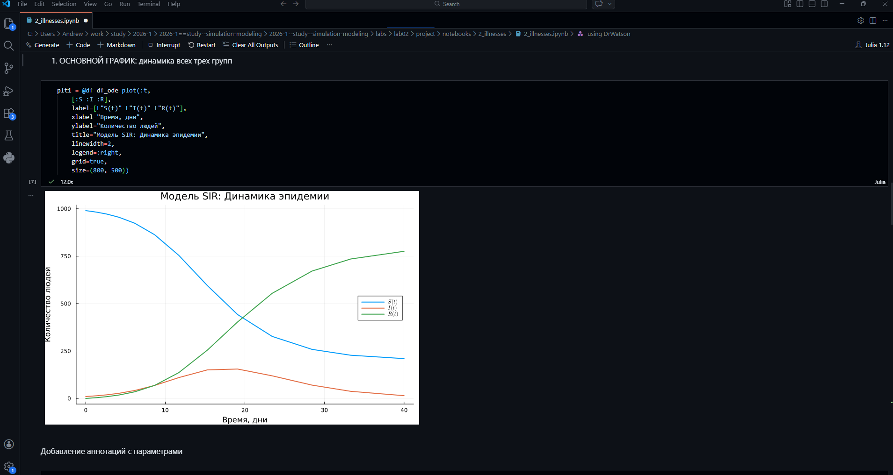
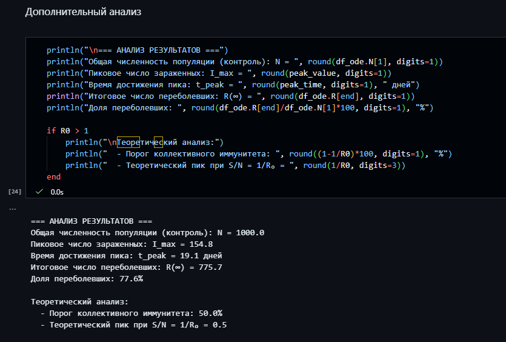
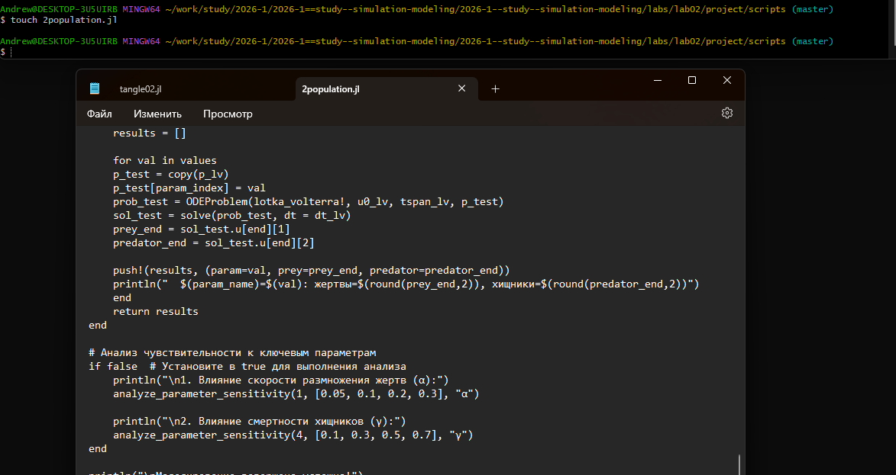
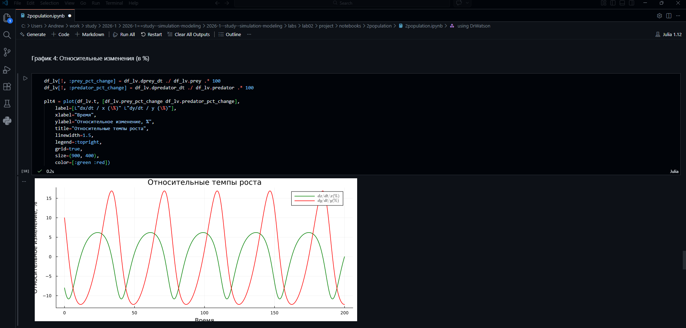
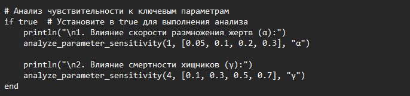

---
## Author
author:
  name: Софич Андрей Геннадьевич
  degrees: DSc
  orcid: 0000-0002-0877-7063
  email: safich05@mail.ru
  affiliation:
    - name: Российский университет дружбы народов
      country: Российская Федерация
      postal-code: 117198
      city: Москва
      address: ул. Миклухо-Маклая, д. 6
## Title
title: Структура научной презентации
subtitle: Простейший вариант
license: CC BY
date: today
date-format: "YYYY-MM-DD" # Example: 2025-09-06
---

## Докладчик

:::::::::::::: {.columns align=center}
::: {.column width="70%"}

  * Софич Андрей Геннадьевич

:::
::: {.column width="30%"}

:::
::::::::::::::

## Актуальность

- Провести ознакомлдение с основными моделями

## Цели и задачи

Проанализировать основные модели и разобраться в их применении

## Выполнение лабораторной работы

Создаем рабочий каталог и инициализируем проект в julia.

##

Устанавилваем все необходимые пакеты.

##

Проверяем наличие всех пакетов в файле, если какого-то пакета нет - добавляем его.

##

Создаем необходимый файл и прописываем в него код по модели SIR .

##

Запускаем файл и проверяем его работу, не забываем, что у нас создаются графики в папке plots.

##

Генерируем из литературного кода в произвольные форматы.

##

Окрываем код через jupyter notebook и запускаем его, убеждаемся, что все работает.

##

Просматриваем результаты анализа модели.

##

Создаем файл, в котором будет реализована модель Лотки-Вольтерры.

##

Запускаем файл, проверяем выполнение и графики, созданные при компилировании.

##

Генерируем из литературного кода в произвольные форматы, открываем код в jupyter.

##

Добавляем вычисление для набора параметров.

##

Выплняем документирование в отчете.

## Выводы
В данной работе мы проанализировали основные модели и разобрались в их применении.
