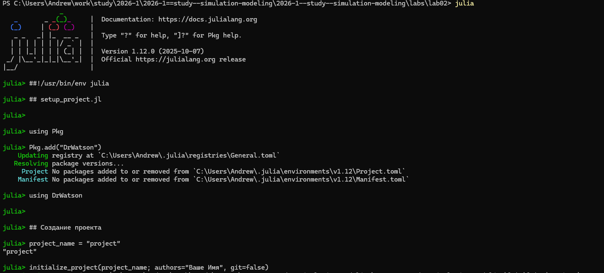
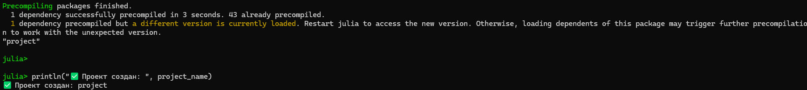
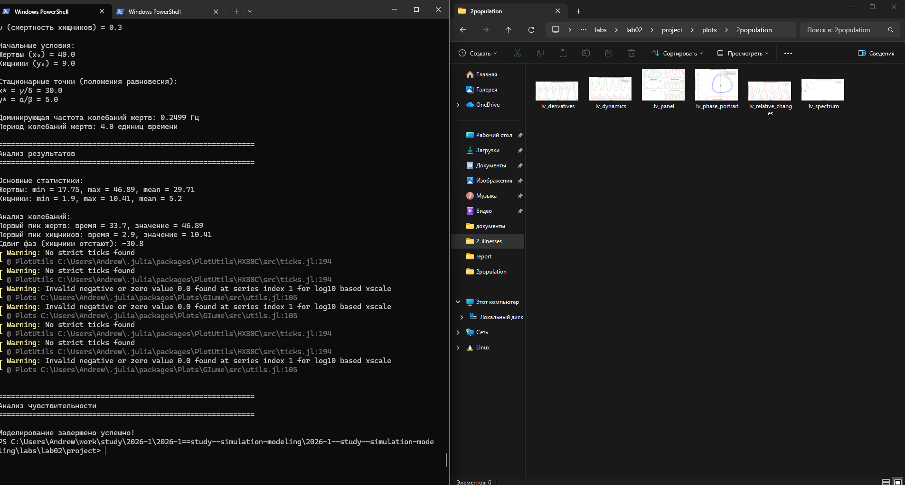
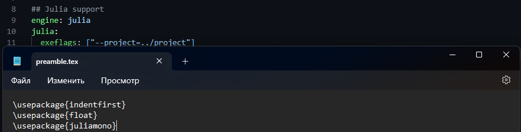

---
## Author
author:
  name: Андрей Геннадьевич Софич
  degrees: DSc
  orcid: 0000-0002-0877-7063
  email: safich05@mail.ru					
  affiliation:
    - name: Российский университет дружбы народов
      country: Российская Федерация
      postal-code: 117198
      city: Москва
      address: ул. Миклухо-Маклая, д. 6

## Title
title: "Лабораторная работа №2"
subtitle: "Основные модели: SIR и модель Лотки-Вольтерры"
license: "CC BY"
---

# Цель работы

Проанализировать основные модели и разобраться в их применении

# Задание

Провести анализ двух основных моделей и сгенеририровать коды

# Выполнение лабораторной работы

Создаем рабочий каталог и инициализируем проект в julia ([рис. @fig-001]).

{#fig-001 width=70%}

Устанавилваем все необходимые пакеты ([рис. @fig-002]).

{#fig-002 width=70%}

Проверяем наличие всех пакетов в файле, если какого-то пакета нет - добавляем его ([рис. @fig-003]).

{#fig-003 width=70%}

Создаем необходимый файл и прописываем в него код по модели SIR  ([рис. @fig-004]).

{#fig-004 width=70%}

Запускаем файл и проверяем его работу, не забываем, что у нас создаются графики в папке plots ([рис. @fig-005]).

{#fig-005 width=70%}

Генерируем из литературного кода в произвольные форматы ([рис. @fig-006]).

{#fig-006 width=70%}

Окрываем код через jupyter notebook и запускаем его, убеждаемся, что все работает ([рис. @fig-007]).

{#fig-007 width=70%}

Просматриваем результаты анализа модели ([рис. @fig-008]).

{#fig-008 width=70%}

Создаем файл, в котором будет реализована модель Лотки-Вольтерры ([рис. @fig-009]).

{#fig-009 width=70%}

Запускаем файл, проверяем выполнение и графики, созданные при компилировании ([рис. @fig-010]).

{#fig-010 width=70%}

Генерируем из литературного кода в произвольные форматы, открываем код в jupyter   ([рис. @fig-011]).

{#fig-011 width=70%}

Добавляем вычисление для набора параметров ([рис. @fig-012]).

{#fig-012 width=70%}

Выплняем документирование в отчете ([рис. @fig-013]).

{#fig-013 width=70%}

# Выводы

В данной работе мы проанализировали основные модели и разобрались в их применении.

