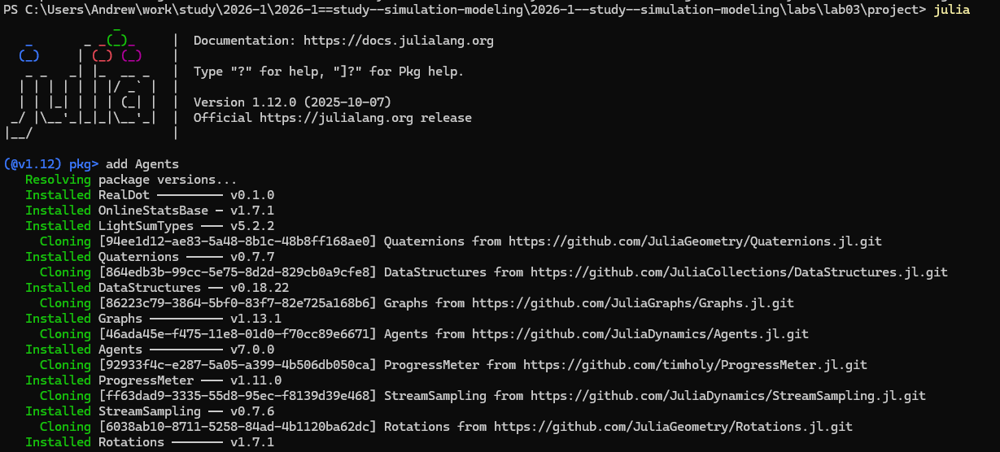
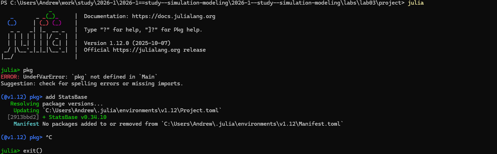
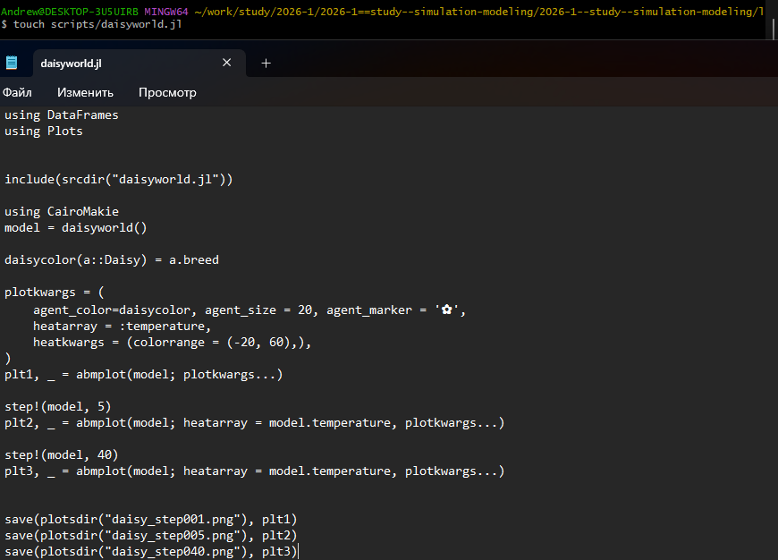
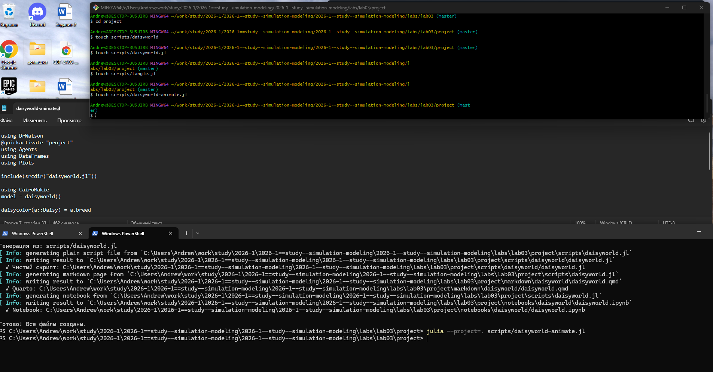
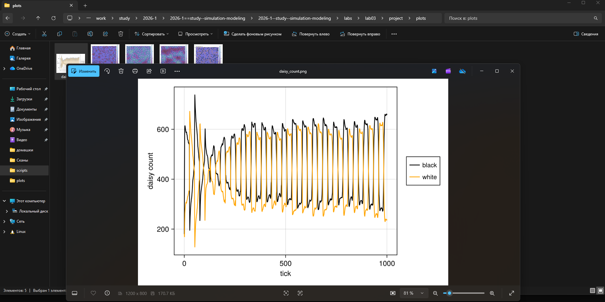
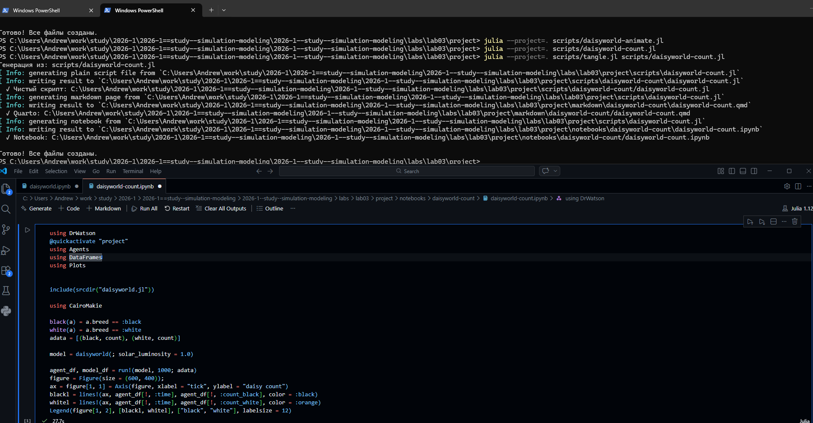
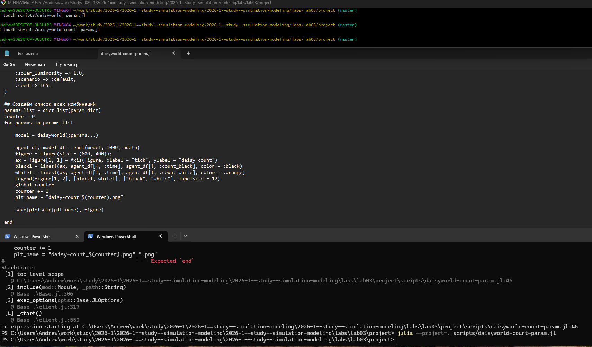
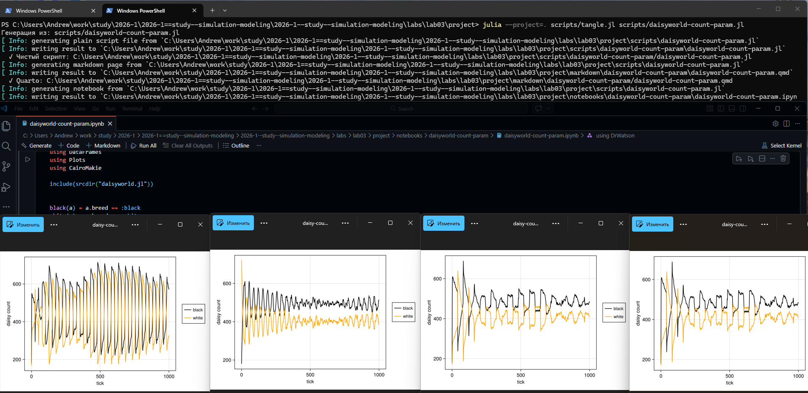
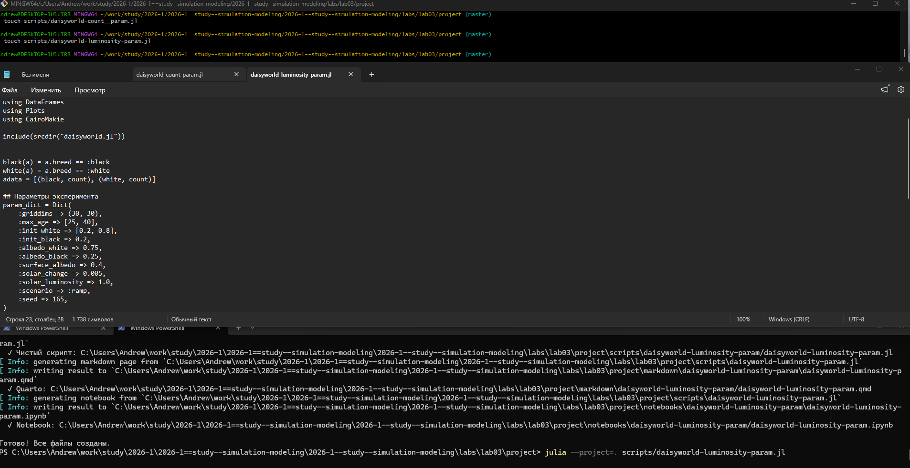

---
## Author
author:
  name: Софич Андрей Геннадьевич
  degrees: DSc
  orcid: 0000-0002-0877-7063
  email: safich05@mail.ru
  affiliation:
    - name: Российский университет дружбы народов
      country: Российская Федерация
      postal-code: 117198
      city: Москва
      address: ул. Миклухо-Маклая, д. 6
## Title
title: Лабораторная работа №3
subtitle: Агентное моделирование
license: CC BY
date: today
date-format: "2026-21-03" # Example: 2025-09-06
---

Докладчик

:::::::::::::: {.columns align=center}
::: {.column width="70%"}

  * Софич Андрей Геннадьевич

:::
::: {.column width="30%"}

:::
::::::::::::::

## Актуальность

- Провести ознакомлдение с агентным моделированием

## Цели и задачи

Изучить в теории и на практике возможности агентного моделирования.

## Выполнение лабораторной работы

Создаем рабочий каталог и инициализируем проект в julia 

##

Устанавилваем все необходимые пакеты (Agents) 

##

Устанавливаем дополнительные пакеты для работы с агентным моделированием 

##

Создаем файл в папке scr, в котором мы определим тип агента и функции шага модели  

}

##

Создаем исполняемый файл в папке scripts и прописываем в нем код 

##

Запускаем файл и анализируем тепловую карту, которая будет представлять собой температуру поверхности модели. Маргаритки будут отображаться черно-белыми в соответствии с их видом. 

##

Преобразовываем код в произвольные стили, открываем jupyter файл и убеждаемся в правильной компиляции. 

##

Создаем файл с анимацией, прописываем в нем код и запускаем. 

##

Результат можно увидеть в папке plots или по ссылке в rutube:

https://rutube.ru/video/fc59731ceb08176e1f6a8170228c0836/

##

Создаем, заполняем и запускаем файл, в котором наглядно показана динамика числа маргариток 

##

Наглядно видим результат запуска файла. 

##

Преобразовываем код в произвольные стили, открываем jupyter файл и убеждаемся в правильной компиляции. 

##

Создаем, заполняем и запускаем файл, который построит комплексный график изменения числа маргариток,температуры,альбедо в зависимости от модельного времени 

##

Заходим в папку plots и открываем наши графики, анализируем поведение модели 

##

Преобразовываем код в произвольные стили, открываем jupyter файл и убеждаемся в правильной компиляции. 

##

Мы можем расширить базовую визуализацию за счет параметров. Для этого создаем новый файл, в котором прописываем параметры и на выходе получаем несколько троек графиков для каждого набора параметров

##

Преобразовываем код в произвольные стили, открываем jupyter файл и убеждаемся в правильной компиляции. 

##

Создаем файл, в котором зависимо от  заданого набора параметров можно построить график динамика числа маргаритов в зависимости от времени, заполняем  и запускаем его 

##

Преобразовываем код в произвольные стили, открываем jupyter файл. анализируем получившиеся графики,зависящие от наших заданных параметров 

##

Создаем, заполняем и запускаем файл, в котором можно построить комплексные графики, задав произвольные параметры 

##

Преобразовываем код в произвольные стили, открываем jupyter файл. Анализируем получившиеся графики,зависящие от наших заданных параметров 

## Выводы
В данной работе мы разобрались с агентным моделированием и реализовали его на практике.
