---
## Author
author:
  name: Андрей Геннадьевич Софич
  degrees: DSc
  orcid: 0000-0002-0877-7063
  email: safich05@mail.ru					
  affiliation:
    - name: Российский университет дружбы народов
      country: Российская Федерация
      postal-code: 117198
      city: Москва
      address: ул. Миклухо-Маклая, д. 6

## Title
title: "Лабораторная работа №3"
subtitle: "Агентное моделирование"
license: "CC BY"
---

# Цель работы

Изучить в теории и на практике возможности агентного моделирования.

# Задание

Применить агентное моделирование на модели daisyworld.

# Выполнение лабораторной работы

Создаем рабочий каталог и инициализируем проект в julia ([рис. @fig-001]).

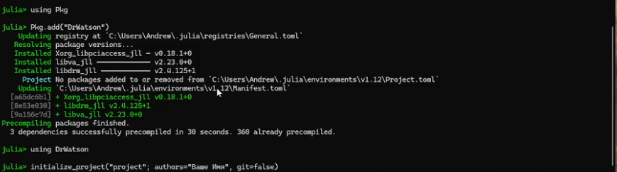{#fig-001 width=70%}

Устанавилваем все необходимые пакеты (Agents) ([рис. @fig-002]).

{#fig-002 width=70%}

Устанавливаем дополнительные пакеты для работы с агентным моделированием ([рис. @fig-003]).

{#fig-003 width=70%}

Создаем файл в папке scr, в котором мы определим тип агента и функции шага модели  ([рис. @fig-004]).

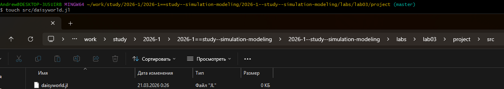{#fig-004 width=70%}

Создаем исполняемый файл в папке scripts и прописываем в нем код ([рис. @fig-005]).

{#fig-005 width=70%}

Запускаем файл и анализируем тепловую карту, которая будет представлять собой температуру поверхности модели. Маргаритки будут отображаться черно-белыми в соответствии с их видом. ([рис. @fig-006]).

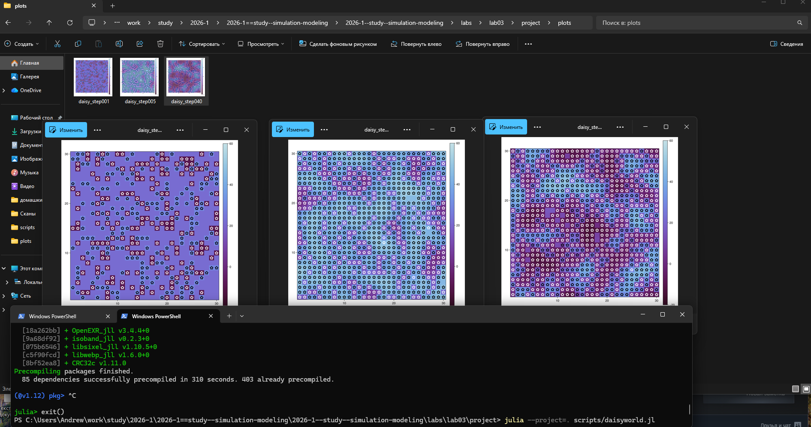{#fig-006 width=70%}

Преобразовываем код в произвольные стили, открываем jupyter файл и убеждаемся в правильной компиляции. ([рис. @fig-007]).

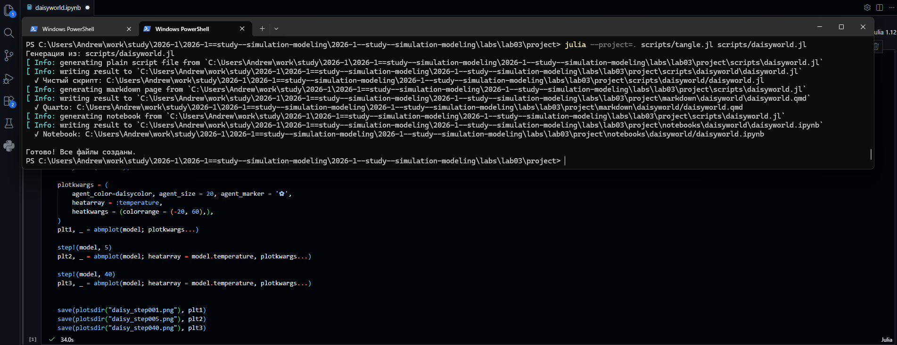{#fig-007 width=70%}

Создаем файл с анимацией, прописываем в нем код и запускаем. ([рис. @fig-008]).

{#fig-008 width=70%}

Результат можно увидеть в папке plots или по ссылке в rutube:
https://rutube.ru/video/fc59731ceb08176e1f6a8170228c0836/ ([рис. @fig-009]).

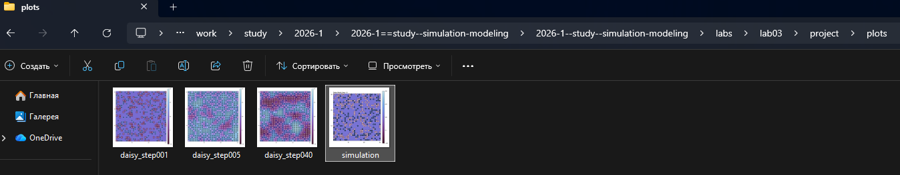{#fig-009 width=70%}

https://rutube.ru/video/fc59731ceb08176e1f6a8170228c0836/

Создаем, заполняем и запускаем файл, в котором наглядно показана динамика числа маргариток ([рис. @fig-010]).

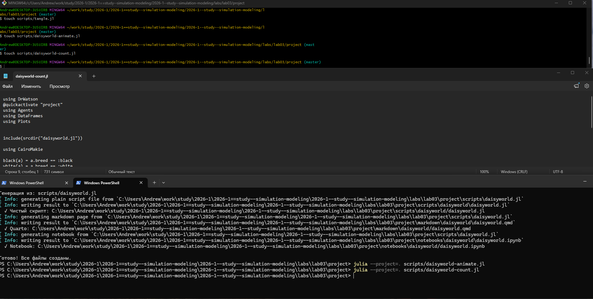{#fig-010 width=70%}

Наглядно видим результат запуска файла. ([рис. @fig-011]).

{#fig-011 width=70%}

Преобразовываем код в произвольные стили, открываем jupyter файл и убеждаемся в правильной компиляции. ([рис. @fig-012]).

{#fig-012 width=70%}

Создаем, заполняем и запускаем файл, который построит комплексный график изменения числа маргариток,температуры,альбедо в зависимости от модельного времени ([рис. @fig-013]).

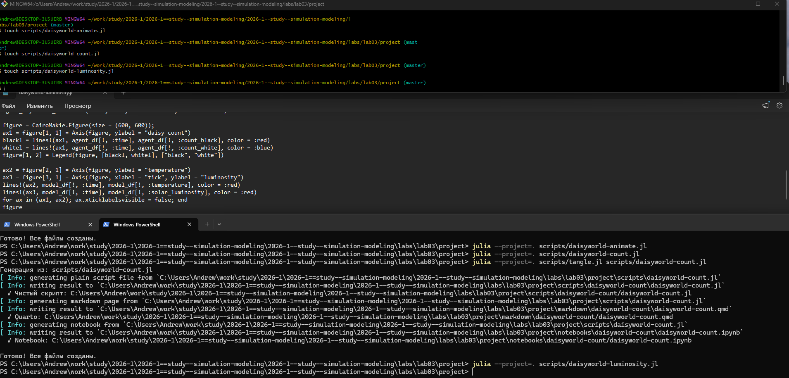{#fig-013 width=70%}

Заходим в папку plots и открываем наши графики, анализируем поведение модели ([рис. @fig-014]).

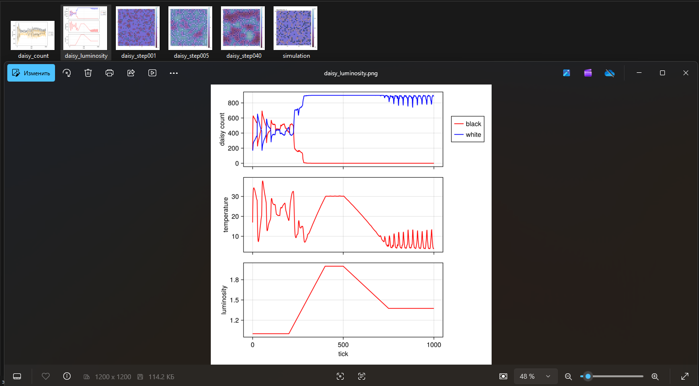{#fig-014 width=70%}

Преобразовываем код в произвольные стили, открываем jupyter файл и убеждаемся в правильной компиляции. ([рис. @fig-015]).

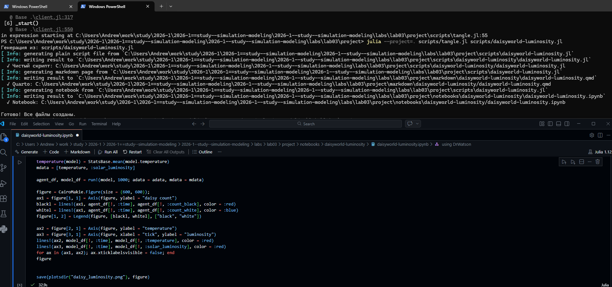{#fig-015 width=70%}

Мы можем расширить базовую визуализацию за счет параметров. Для этого создаем новый файл, в котором прописываем параметры и на выходе получаем несколько троек графиков для каждого набора параметров ([рис. @fig-016]).

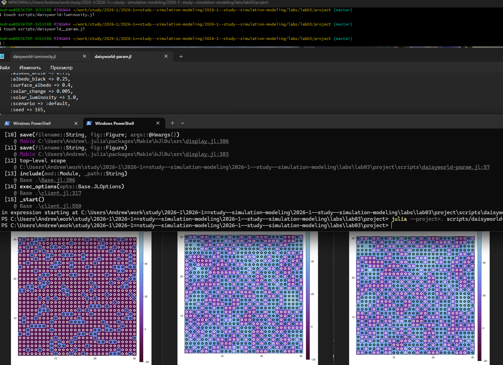{#fig-016 width=70%}

Преобразовываем код в произвольные стили, открываем jupyter файл и убеждаемся в правильной компиляции. ([рис. @fig-017]).

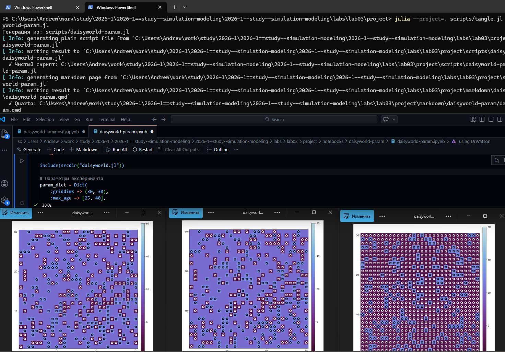{#fig-017 width=70%}

Создаем файл, в котором зависимо от  заданого набора параметров можно построить график динамика числа маргаритов в зависимости от времени, заполняем  и запускаем его ([рис. @fig-018]).

{#fig-018 width=70%}

Преобразовываем код в произвольные стили, открываем jupyter файл. анализируем получившиеся графики,зависящие от наших заданных параметров ([рис. @fig-019]).

{#fig-019 width=70%}

Создаем, заполняем и запускаем файл, в котором можно построить комплексные графики, задав произвольные параметры ([рис. @fig-020]).

{#fig-020 width=70%}

Преобразовываем код в произвольные стили, открываем jupyter файл. Анализируем получившиеся графики,зависящие от наших заданных параметров ([рис. @fig-021]).

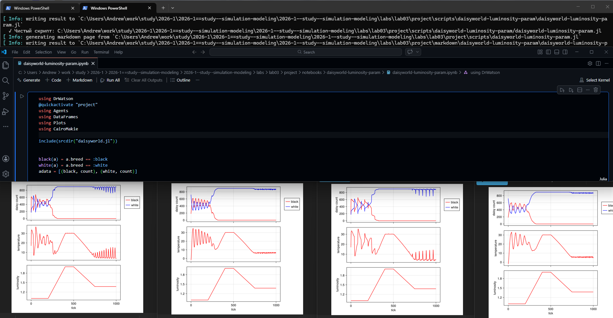{#fig-021 width=70%}













# Выводы

В данной работе мы разобрались с агентным моделированием и реализовали его на практике.

