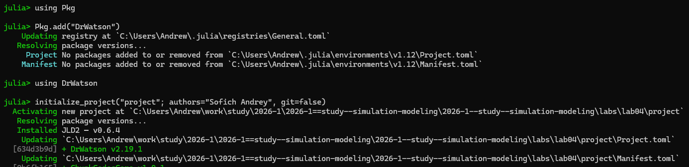
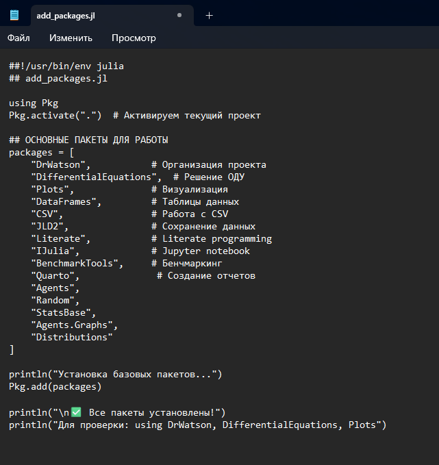
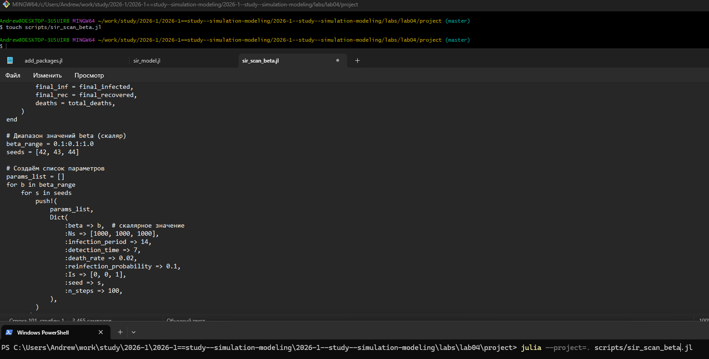
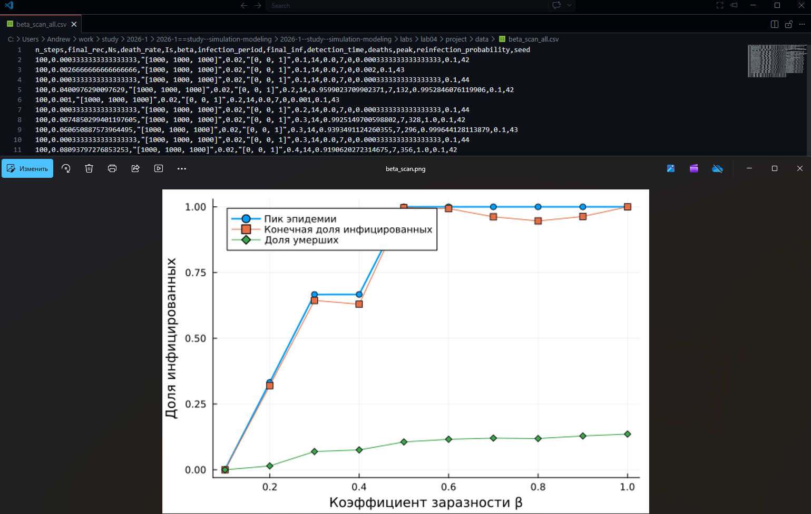
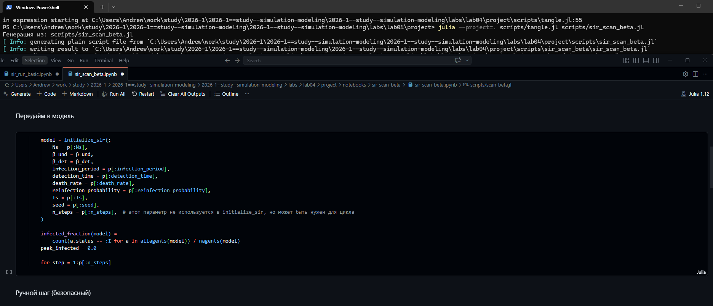
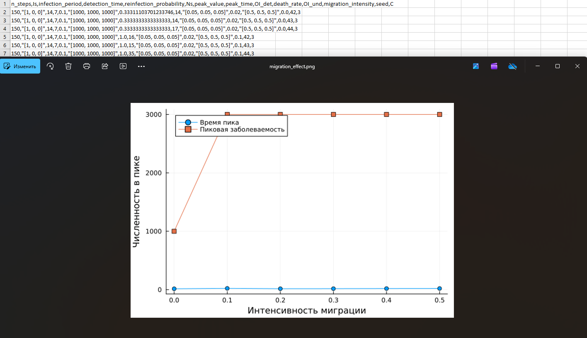
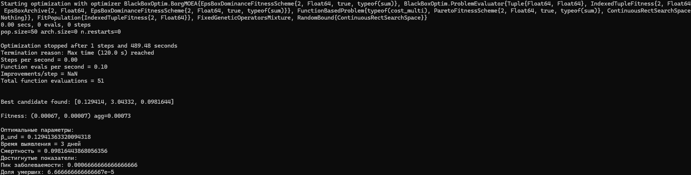
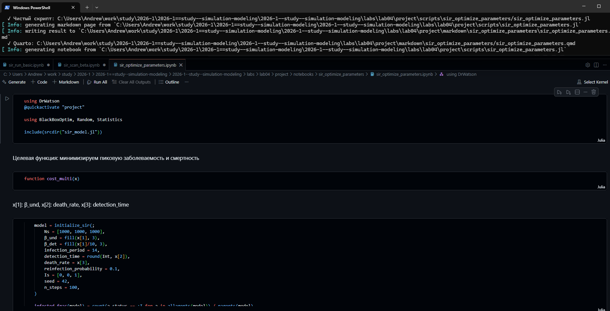
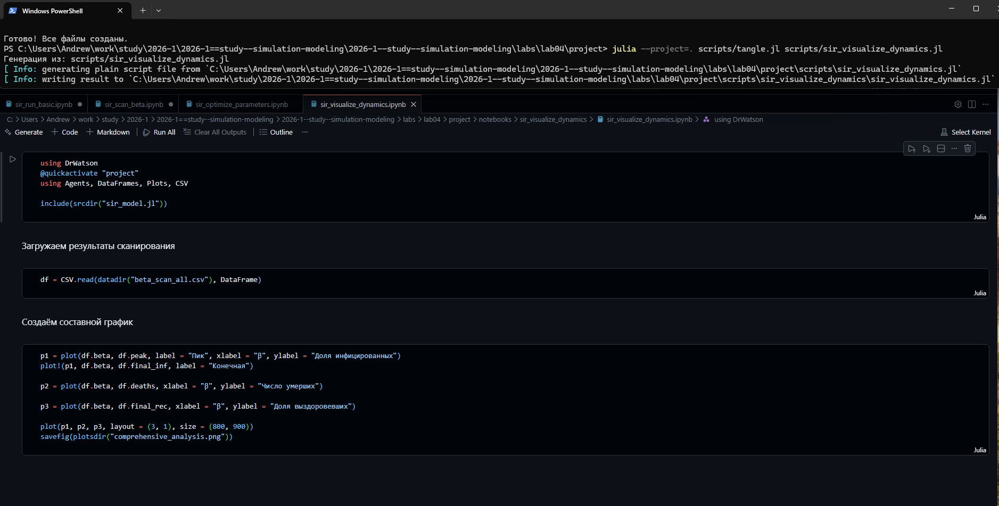

---
## Author
author:
  name: Софич Андрей Геннадьевич
  degrees: DSc
  orcid: 0000-0002-0877-7063
  email: safich05@mail.ru
  affiliation:
    - name: Российский университет дружбы народов
      country: Российская Федерация
      postal-code: 117198
      city: Москва
      address: ул. Миклухо-Маклая, д. 6
## Title
title: Лабораторная работа №3
subtitle: Агентное моделирование
license: CC BY
date: today
date-format: "2026-04-04" # Example: 2025-09-06
---

Докладчик

:::::::::::::: {.columns align=center}
::: {.column width="70%"}

  * Софич Андрей Геннадьевич

:::
::: {.column width="30%"}

:::
::::::::::::::

## Актуальность

- Провести ознакомлдение с агентным моделированием и применить его на базовой модели SIR

## Цели и задачи

Изучить и применить агентное моделирование на базовой модели

## Выполнение лабораторной работы

Создаем рабочий каталог и инициализируем проект в julia 

##

Создаем файл, где прописываем пакеты, необходимые для выполнения работы.

##

Запускаем файл add_packages и скачаиваем все необходимые пакеты.

##

Создаем файл в папке scr, в котором мы определим тип агента и функции шага модели и запускаем его .

##

Создаем файл с базовым экспериментом, который запускает один эксперимент с фиксированными параметрами (по умолчанию) и сохраняет динамику численности агентов.

##

Анализируем полученный график, который показывает нам корреляцию основных параметров.

##

Преобразовываем код в произвольные стили, открываем jupyter файл и убеждаемся в правильной компиляции. 

##

Создаем файл, который исследует, как изменение базовой заразности (β_und и пропорционально β_det) влияет на эпидемические показатели: пик заболеваемости, долю переболевших, число умерших. 

##

В результате получае график сканирования и таблицу с параметрами по всем экспериментам (меняли β_und и пропорционально β_det и seed) .

##

Преобразовываем код в произвольные стили, открываем jupyter файл и убеждаемся в правильной компиляции.

##

Создаем файл, который исследует, как интенсивность перемещения людей между городами влияет на скорость распространения эпидемии (время достижения пика) и масштаб пика. Инфекция начинается только в одном городе, остальные изначально здоровы.

##

Получаем график и таблицу с различными коэффициентами, можемпроанализировать график миграции .

##

Преобразовываем код в произвольные стили, открываем jupyter файл и убеждаемся в правильной компиляции.

##

Создаем, заполняем и запускаем файл, который ищет оптимальные комбинации параметров, минимизирующие одновременно два критерия: пиковую заболеваемость и долю умерших.

##

Результаты выведет в консоль. Там буду оптимизированые мараметры для минимизации.

##

Преобразовываем код в произвольные стили, открываем jupyter файл и убеждаемся в правильной компиляции. 

##

Создаем файл, который на основе предыдущих результатов будет создавать сводную визуализацию 

##

Получаем общий график, созданный на основе посчитанных ранее данных 

##

Преобразовываем код в произвольные стили, открываем jupyter файл и убеждаемся в правильной компиляции. 

## Выводы
В данной работе мы разобрались с агентным моделированием и реализовали его на практике.
