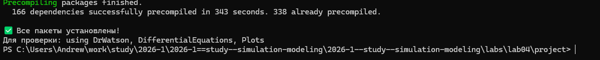
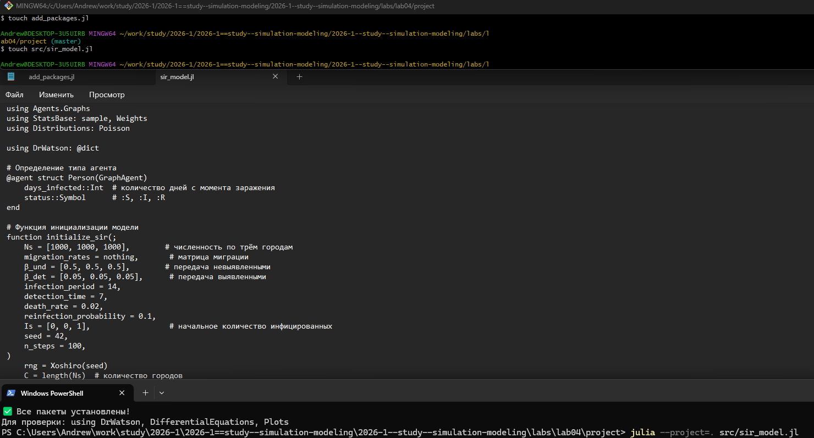
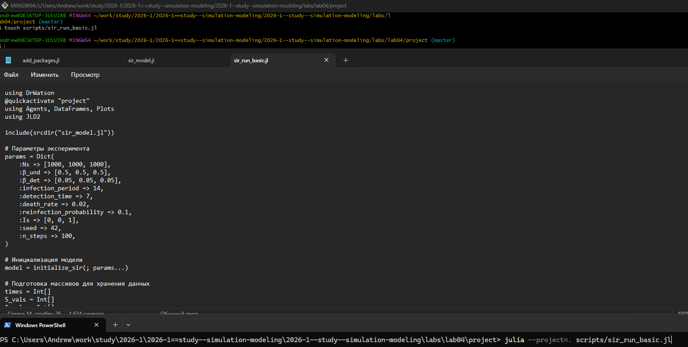
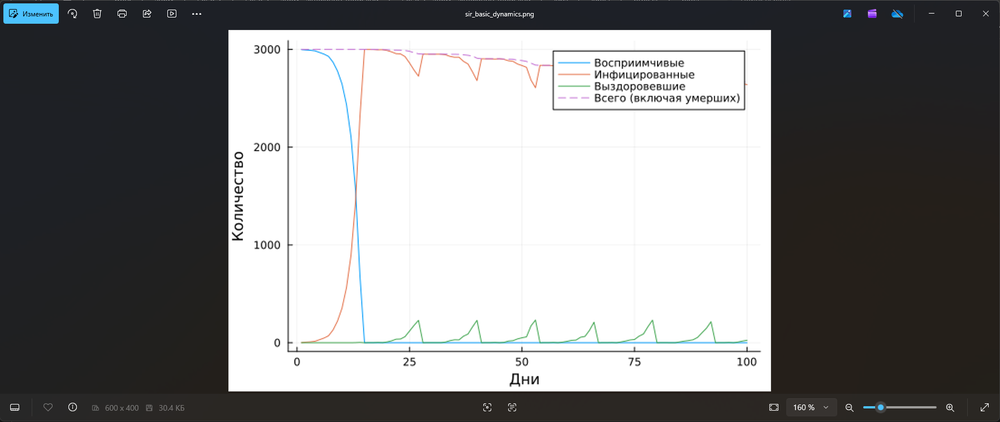
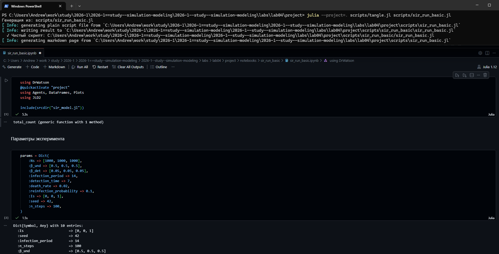
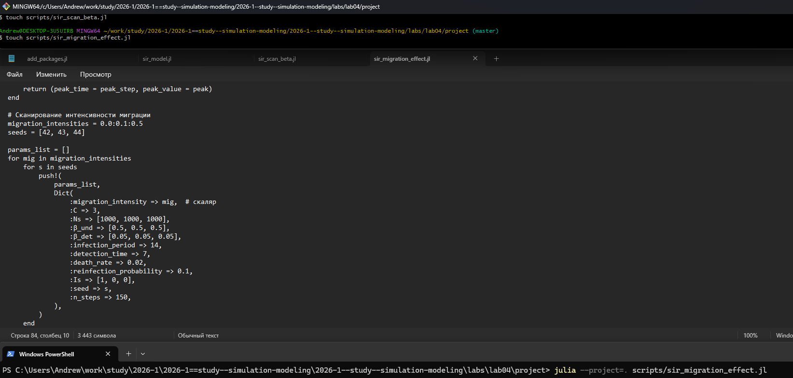
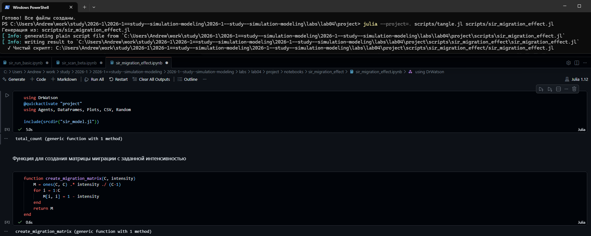
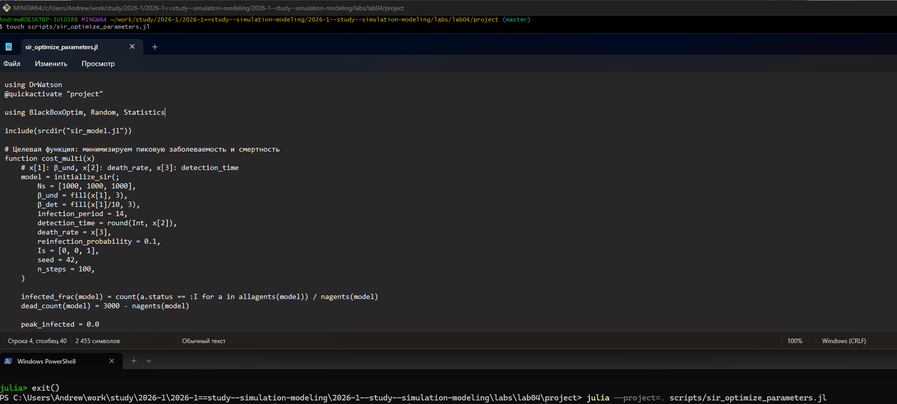
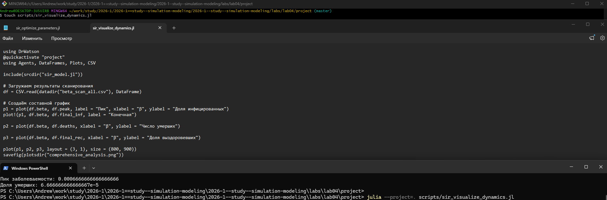
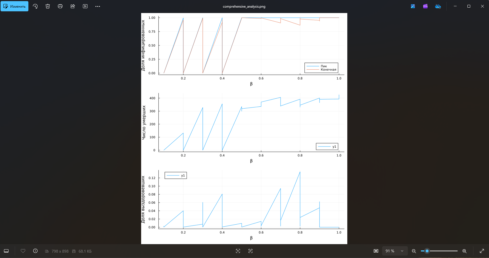

---
## Author
author:
  name: Андрей Геннадьевич Софич
  degrees: DSc
  orcid: 0000-0002-0877-7063
  email: safich05@mail.ru					
  affiliation:
    - name: Российский университет дружбы народов
      country: Российская Федерация
      postal-code: 117198
      city: Москва
      address: ул. Миклухо-Маклая, д. 6

## Title
title: "Лабораторная работа №4"
subtitle: "Реализация основных моделей в агентном подходе"
license: "CC BY"
---

# Цель работы

Изучить и применить агентное моделирование на базовой модели

# Задание

Применить агентное моделирование на модели SIR.

# Выполнение лабораторной работы

Создаем рабочий каталог и инициализируем проект в julia ([рис. @fig-001]).

{#fig-001 width=70%}

Создаем файл, где прописываем пакеты, необходимые для выполнения работы ([рис. @fig-002]).

{#fig-002 width=70%}

Запускаем файл add_packages и скачаиваем все необходимые пакеты ([рис. @fig-003]).

{#fig-003 width=70%}

Создаем файл в папке scr, в котором мы определим тип агента и функции шага модели и запускаем его  ([рис. @fig-004]).

{#fig-004 width=70%}

Создаем файл с базовым экспериментом, который запускает один эксперимент с фиксированными параметрами (по умолчанию) и сохраняет динамику численности агентов ([рис. @fig-005]).

{#fig-005 width=70%}

Анализируем полученный график, который показывает нам корреляцию основных параметров ([рис. @fig-006]).

{#fig-006 width=70%}

Преобразовываем код в произвольные стили, открываем jupyter файл и убеждаемся в правильной компиляции. ([рис. @fig-007]).

{#fig-007 width=70%}

Создаем файл, который исследует, как изменение базовой заразности (β_und и пропорционально β_det) влияет на эпидемические показатели: пик заболеваемости, долю переболевших, число умерших. ([рис. @fig-008]).

{#fig-008 width=70%}

В результате получае график сканирования и таблицу с параметрами по всем экспериментам (меняли β_und и пропорционально β_det и seed)  ([рис. @fig-009]).

{#fig-009 width=70%}

Преобразовываем код в произвольные стили, открываем jupyter файл и убеждаемся в правильной компиляции. ([рис. @fig-010]).

{#fig-010 width=70%}

Создаем файл, который исследует, как интенсивность перемещения людей между городами влияет на скорость распространения эпидемии (время достижения пика) и масштаб пика. Инфекция начинается только в одном городе, остальные изначально здоровы.  ([рис. @fig-011]).

{#fig-011 width=70%}

Получаем график и таблицу с различными коэффициентами, можемпроанализировать график миграции ([рис. @fig-012]).

{#fig-012 width=70%}

Преобразовываем код в произвольные стили, открываем jupyter файл и убеждаемся в правильной компиляции. ([рис. @fig-013]).

{#fig-013 width=70%}

Создаем, заполняем и запускаем файл, который ищет оптимальные комбинации параметров, минимизирующие одновременно два критерия: пиковую заболеваемость и долю умерших. ([рис. @fig-014]).

{#fig-014 width=70%}

Результаты выведет в консоль. Там буду оптимизированые мараметры для минимизации ([рис. @fig-015]).

{#fig-015 width=70%}

Преобразовываем код в произвольные стили, открываем jupyter файл и убеждаемся в правильной компиляции. ([рис. @fig-016]).

{#fig-016 width=70%}

Создаем файл, который на основе предыдущих результатов будет создавать сводную визуализацию ([рис. @fig-017]).

{#fig-017 width=70%}

Получаем общий график, созданный на основе посчитанных ранее данных ([рис. @fig-018]).

{#fig-018 width=70%}

Преобразовываем код в произвольные стили, открываем jupyter файл и убеждаемся в правильной компиляции. ([рис. @fig-019]).

{#fig-019 width=70%}











# Выводы

В данной работе мы изучили и применили агентное моделирование на базовой модели SIR.

