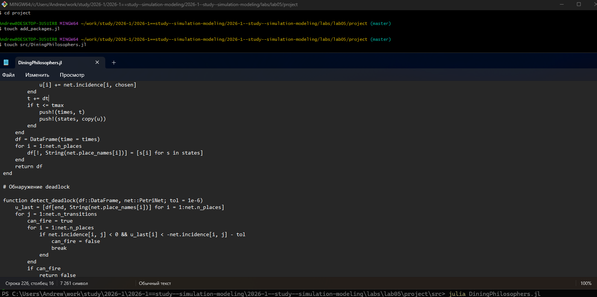
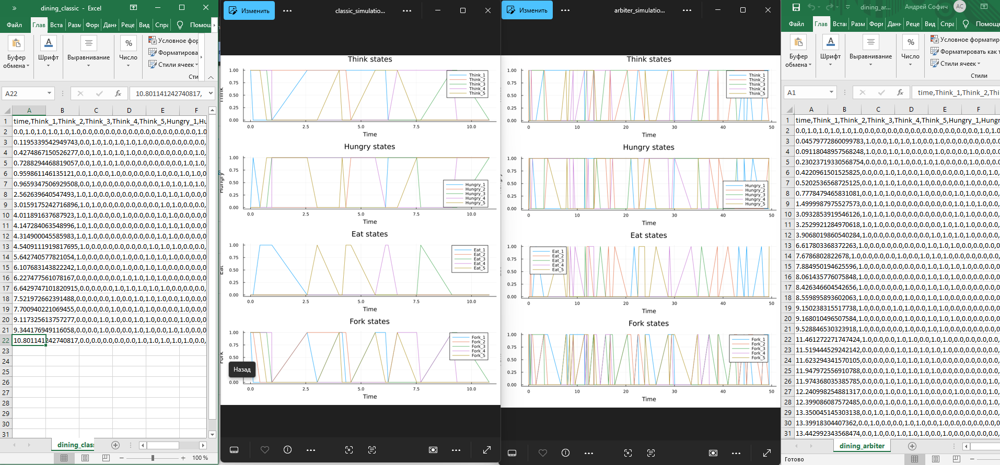
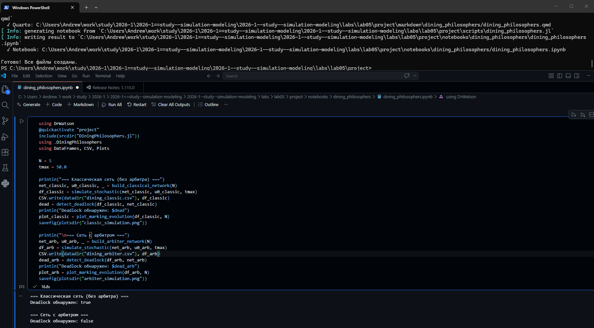
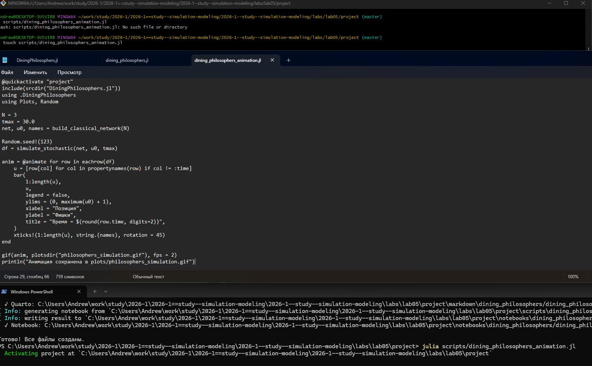
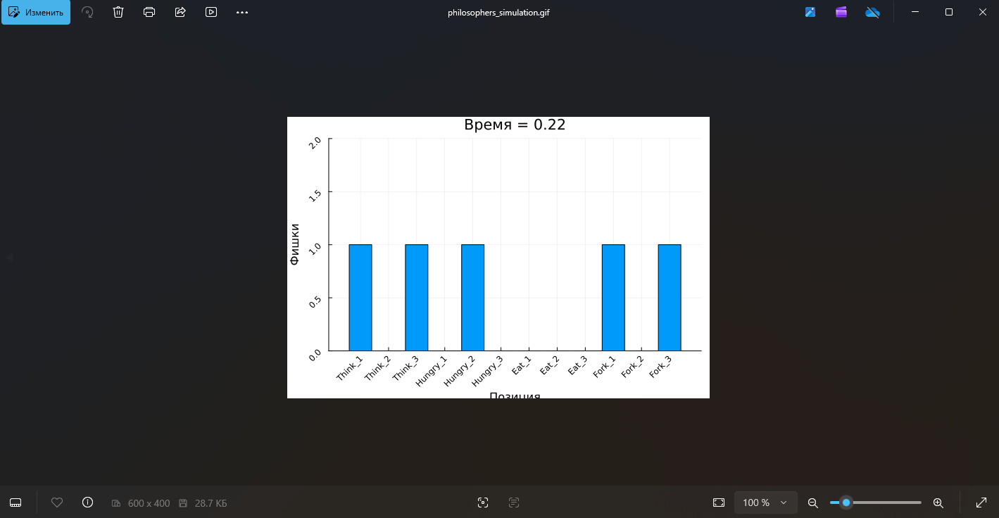
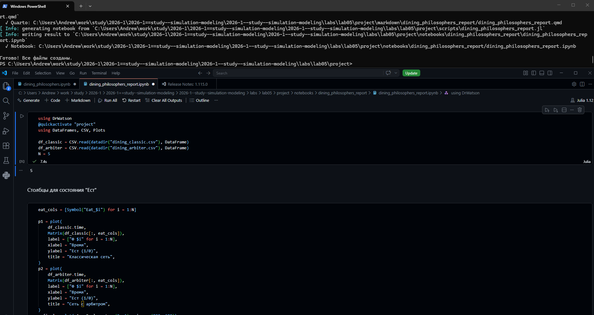

---
## Author
author:
  name: Софич Андрей Геннадьевич
  degrees: DSc
  orcid: 0000-0002-0877-7063
  email: safich05@mail.ru
  affiliation:
    - name: Российский университет дружбы народов
      country: Российская Федерация
      postal-code: 117198
      city: Москва
      address: ул. Миклухо-Маклая, д. 6
## Title
title: Лабораторная работа №5
subtitle: Сеть Петри
license: CC BY
date: today
date-format: "2026-18-04" # Example: 2025-09-06
---
## Докладчик

:::::::::::::: {.columns align=center}
::: {.column width="70%"}

  * Софич Андрей Геннадьевич

:::
::: {.column width="30%"}

:::
::::::::::::::

## Актуальность

Изучить и применить метод сетей Петри на задаче голодных философов

## Цели и задачи

Применить сеть Петри на базовой задаче.

## Выполнение лабораторной работы

Создаем рабочий каталог и инициализируем проект в julia .

##

Создаем файл, где прописываем пакеты, необходимые для выполнения работы и запускаем его.

##

Создаем файл в папке scr, в котором мы пропишем методы моделирования, позиции, переходы и обнаружение deadlock.

##

Создаем и запускаем скрипт,который проводит базовый экперимент для сравнения двух вариантов сети Петри.

##

Получаем результатфы эксперимента для разных вариантов и проводим анализ: модель с арбитром может работаь без блокировки, тогда как классическая рано или поздно придет к deadlock.

##

Преобразовываем код в произвольные стили, открываем jupyter файл и убеждаемся в правильной компиляции.

##

Прописываем скрипт, который создаст наглядную анимацию эксперимента в виде gif, она позволит увидеть как меняется маркировка в каждой позиции и покажет возникновение deadlock.

##

В результате получаем анимацию модели, на ней наглядно видно, что в классической модели произойдет взаимная блокировка.

##

Создаем скрипт с итоговым отчетом, который покажет полный график по каждой модели на основе базового эксперимента, запускаем его и анализируем график.

##

Преобразовываем код в произвольные стили, открываем jupyter файл и убеждаемся в правильной компиляции. 

## Выводы

В данной работе мы изучили и применили сеть Петри на основе базовой задачи про голодных философов.

