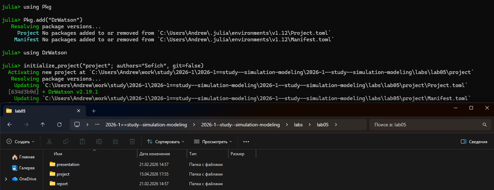
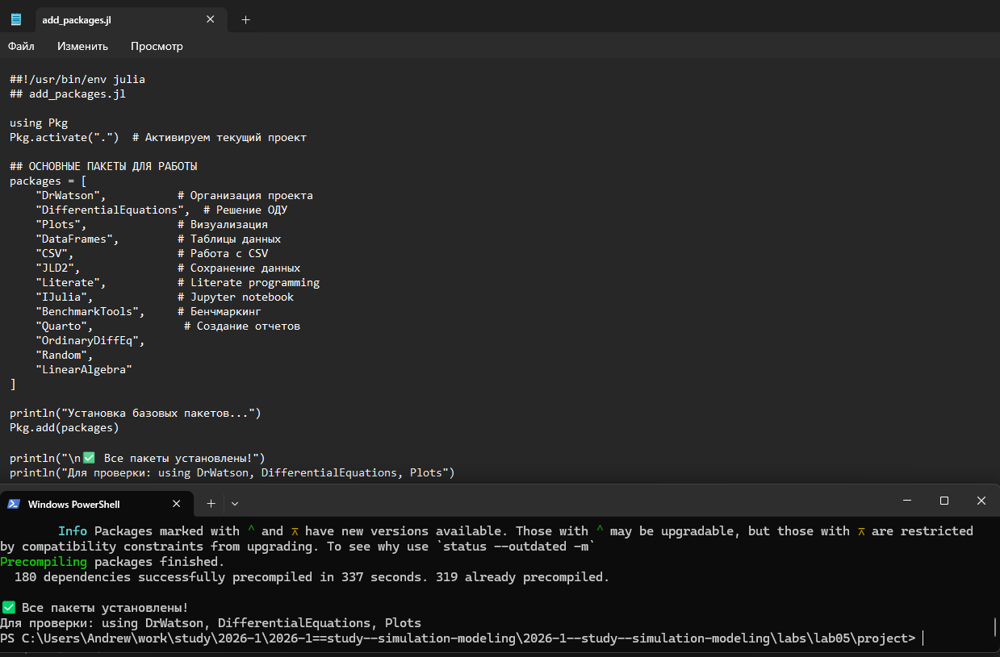
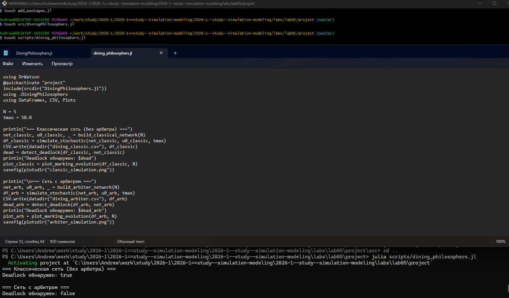
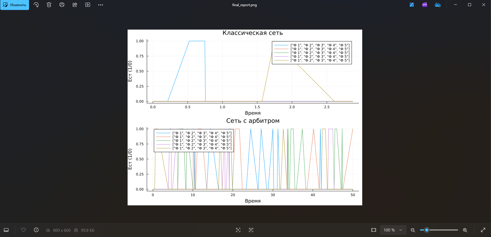

---
## Author
author:
  name: Андрей Геннадьевич Софич
  degrees: DSc
  orcid: 0000-0002-0877-7063
  email: safich05@mail.ru					
  affiliation:
    - name: Российский университет дружбы народов
      country: Российская Федерация
      postal-code: 117198
      city: Москва
      address: ул. Миклухо-Маклая, д. 6

## Title
title: "Лабораторная работа №5"
subtitle: "Аппарат сетей Петри"
license: "CC BY"
---

# Цель работы

Изучить и применить метод сетей Петри на задаче голодных философов

# Задание

Применить сеть Петри на базовой задаче.

# Выполнение лабораторной работы

Создаем рабочий каталог и инициализируем проект в julia ([рис. @fig-001]).

{#fig-001 width=70%}

Создаем файл, где прописываем пакеты, необходимые для выполнения работы и запускаем его ([рис. @fig-002]).

{#fig-002 width=70%}

Создаем файл в папке scr, в котором мы пропишем методы моделирования, позиции, переходы и обнаружение deadlock ([рис. @fig-003]).

{#fig-003 width=70%}

Создаем и запускаем скрипт,который проводит базовый экперимент для сравнения двух вариантов сети Петри  ([рис. @fig-004]).

{#fig-004 width=70%}

Получаем результатфы эксперимента для разных вариантов и проводим анализ: модель с арбитром может работаь без блокировки, тогда как классическая рано или поздно придет к deadlock  ([рис. @fig-005]).

{#fig-005 width=70%}

Преобразовываем код в произвольные стили, открываем jupyter файл и убеждаемся в правильной компиляции ([рис. @fig-006]).

{#fig-006 width=70%}

Прописываем скрипт, который создаст наглядную анимацию эксперимента в виде gif, она позволит увидеть как меняется маркировка в каждой позиции и покажет возникновение deadlock ([рис. @fig-007]).

{#fig-007 width=70%}

В результате получаем анимацию модели, на ней наглядно видно, что в классической модели произойдет взаимная блокировка ([рис. @fig-008]).

{#fig-008 width=70%}

Создаем скрипт с итоговым отчетом, который покажет полный график по каждой модели на основе базового эксперимента, запускаем его и анализируем график  ([рис. @fig-009]).

{#fig-009 width=70%}

Преобразовываем код в произвольные стили, открываем jupyter файл и убеждаемся в правильной компиляции. ([рис. @fig-010]).

{#fig-010 width=70%}





# Выводы

В данной работе мы изучили и применили сеть Петри на основе базовой задачи про голодных философов.

