---
## Author
author:
  name: Софич Андрей Геннадьевич
  degrees: DSc
  orcid: 0000-0002-0877-7063
  email: safich05@mail.ru
  affiliation:
    - name: Российский университет дружбы народов
      country: Российская Федерация
      postal-code: 117198
      city: Москва
      address: ул. Миклухо-Маклая, д. 6
## Title
title: Лабораторная работа №6
subtitle: Реализация основных моделей в подходе сетей Петри
license: CC BY
date: today
date-format: "2026-01-05" # Example: 2025-09-06
---
## Докладчик

:::::::::::::: {.columns align=center}
::: {.column width="70%"}

  * Софич Андрей Геннадьевич

:::
::: {.column width="30%"}

:::
::::::::::::::

# Актуальность

## Актуальность

Изучить и применить метод сетей Петри модели SIR

# Цель

## Цели и задачи

Изучить и проанализировать реализацию сетей петри на базовой модели SIR

# Выполнение лабораторной работы

## Выполнение лабораторной работы

Создаем рабочий каталог и инициализируем проект в julia .

##

Создаем файл, где прописываем пакеты, необходимые для выполнения работы и запускаем его.

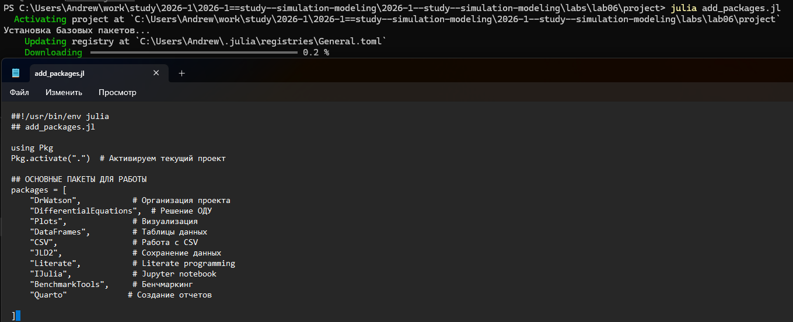

##

Создаем файл в папке scr, в котором мы пропишем основную вычислительную логику модели (детерминированная и стохастическая симуляции, вспомогательные функции и визуализация)

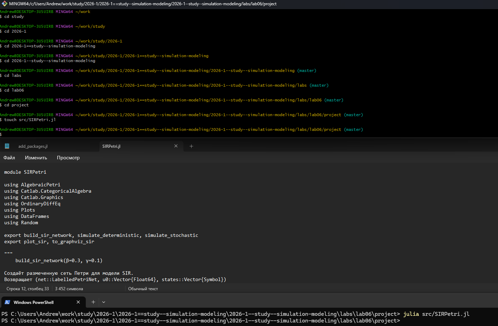

##

Создаем и запускаем скрипт,который проводит базовый прогон модели, задаем основные параметры (бетта, гамма, tmax), зерно для генерации случайных чисел (для стохастической симуляции)

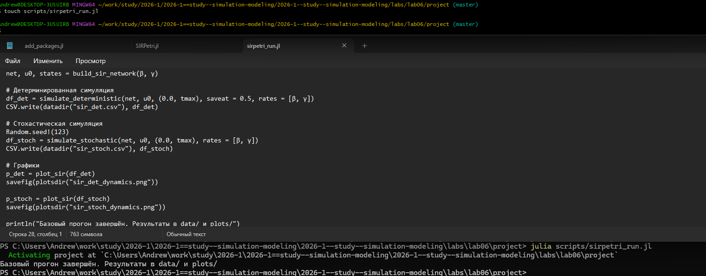

##

Получаем графики прогона для каждой симуляции. Они будут похожи, однако стохастическая симуляция будет иметь шумы из-за влияния случайности. При большом начальном числе восприимчивых (990) стохастическая траектория близка к детерминированной

##

Так же мы получили две таблицы с тремя колонками S I R и подробными числами для обеих симуляций

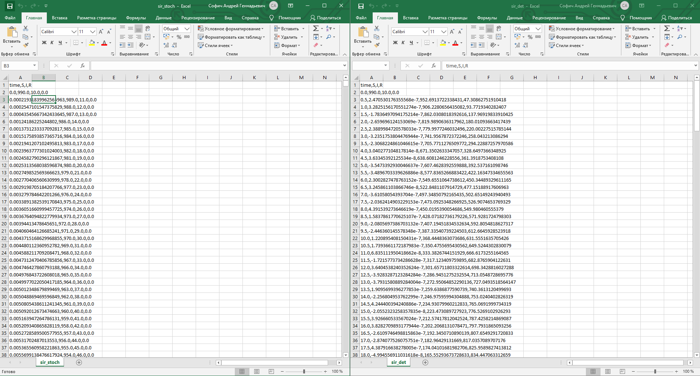

##

Преобразовываем код в произвольные стили и открываем один из них, чтобы убедиться в правильности компиляции

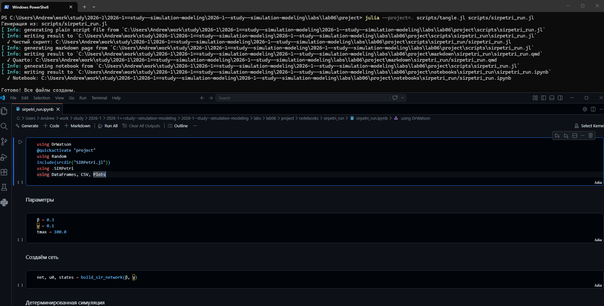

##

Создаем файл, в котором будем исследовать коэффициент заражения бета. Пропишем диапазон переменной бета и запустим детерминированную симуляцию. Для каждого прогона вычисляются максимальное число ифицированных (peak_I) и конечно число выздоровевших final_R

##

В итоге получаем график и подробную таблицу. Как мы можем видеть, при любом бета финальное число выздоровевших почти всегда переходит в R. С ростом бета пик заболеваемости растет, а затем почти все население преболевает

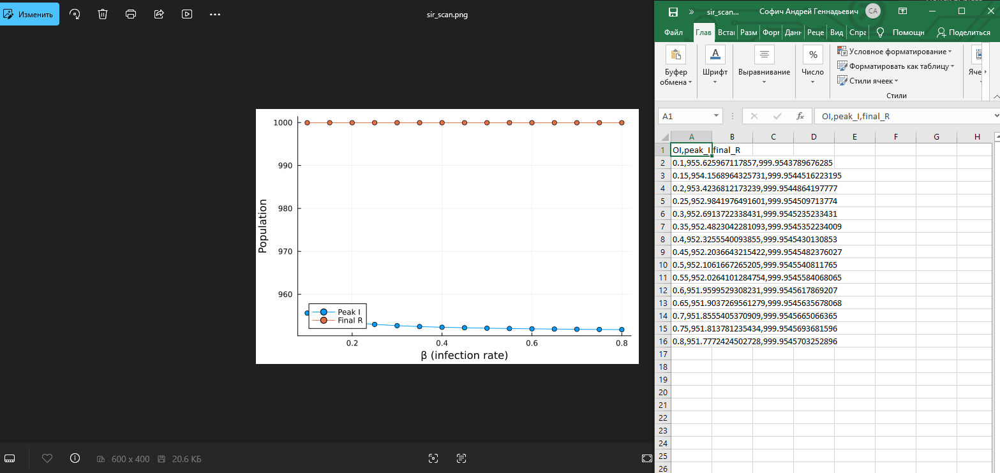

##

Преобразовываем код в произвольные стили, открываем jupyter файл и убеждаемся в правильной компиляции. 

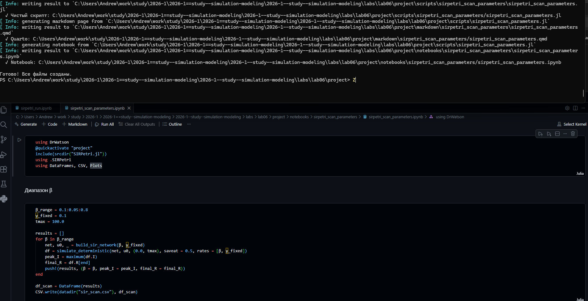

##

Создаем код на основе детерминированной симуляции и делаем gif-анимацию для наглядного анализа распространения эпидемии, его  пик и спад

##

Просматриваем результаты анимации, наглядно видно, как на первых кадрах I растет, S падает. В момент пика I достигает максимума, затем снижается, а R растет.  

::: {.content-visible when-format="html"}
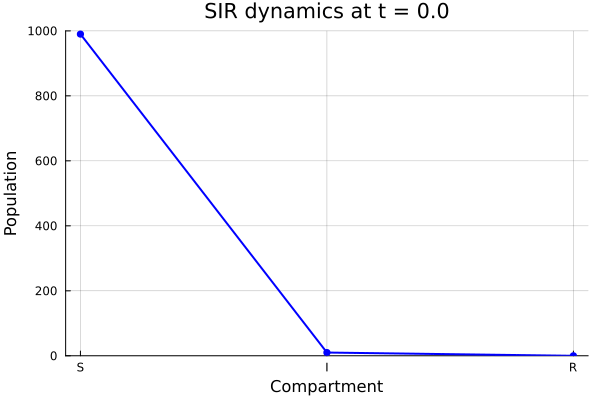{#fig-012 width=70%}
:::

::: {.content-visible when-format="pdf"}
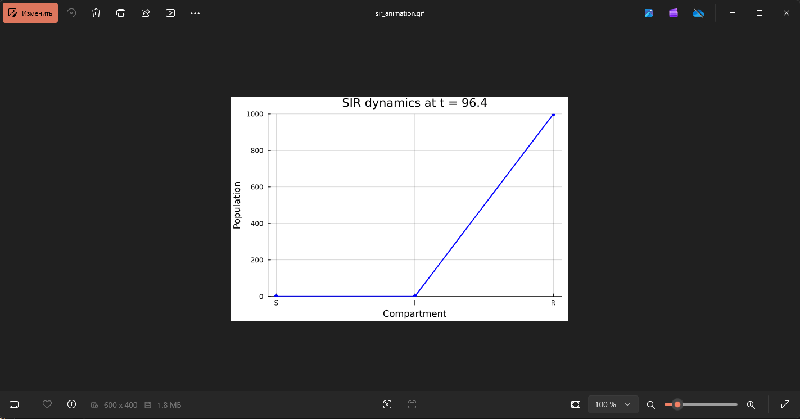{#fig-012 width=70%}
:::

## 

**Ссылки на анимацию на платформах**

**https://rutube.ru/video/3f489af0209fa80963ca823e20d07ba6/**

**https://vkvideo.ru/video-236492644_456239038**

##

Создаем итоговый отчет, который загружает свсе сохраненные результаты и строит сравнительные графики. Сравнение стохастической и детерминиррованной динамик, а также зависимости пика I от бета 

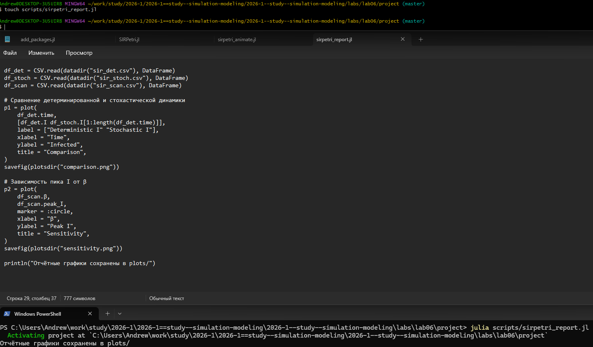

##

В результатах мы видим оба графика. Сравнение динамик показывает, насколько велик разброс, который вызван случайностью. При большой популяции они близки. График чувствительности позволяет оценить как заразность бета влияет на тяжесть эпидемии.  

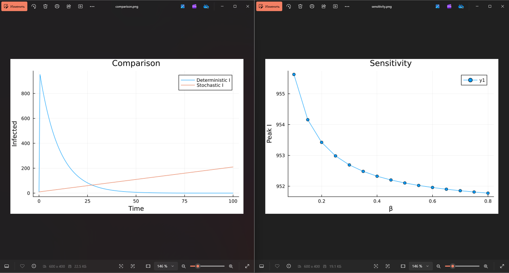

##

Преобразовываем код в произвольные стили, открываем jupyter файл и убеждаемся в правильной компиляции. 

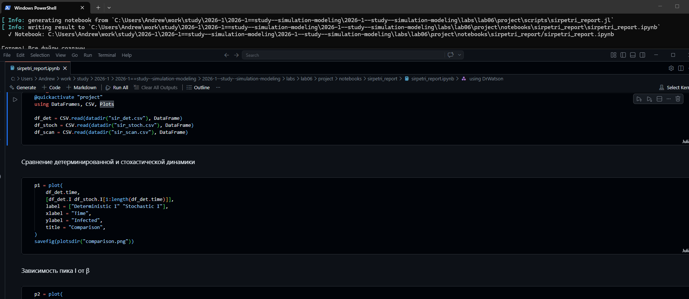

# Выводы

## Выводы

В данной работе мы изучили и применили сеть Петри на основе модели SIR

