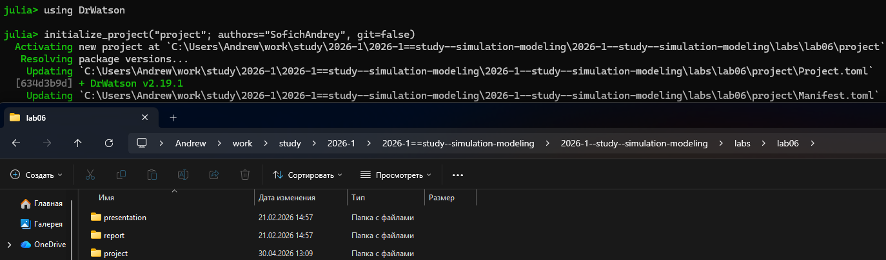
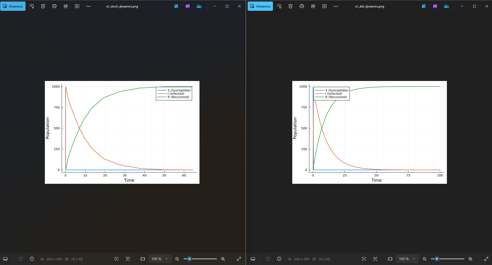
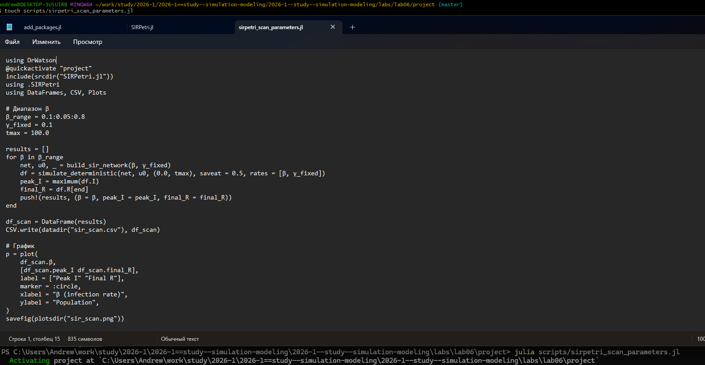
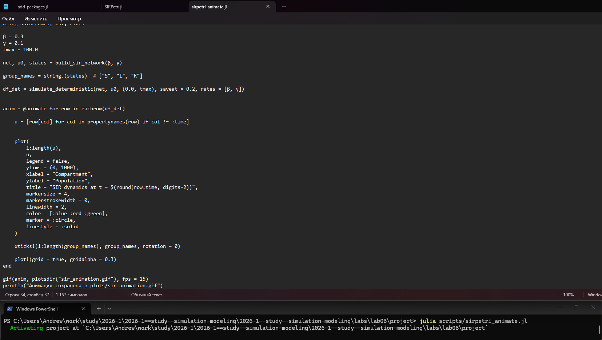

---
## Author
author:
  name: Андрей Геннадьевич Софич
  degrees: DSc
  orcid: 0000-0002-0877-7063
  email: safich05@mail.ru					
  affiliation:
    - name: Российский университет дружбы народов
      country: Российская Федерация
      postal-code: 117198
      city: Москва
      address: ул. Миклухо-Маклая, д. 6

## Title
title: "Лабораторная работа №6"
subtitle: "Реализация основных моделей в подходе сетей Петри"
license: "CC BY"
---

# Цель работы

Изучить и проанализировать реализацию сетей петри на базовой модели SIR

# Задание

Применить сеть Петри на базовой задаче.

# Выполнение лабораторной работы

Создаем рабочий каталог и инициализируем проект в julia ([рис. @fig-001]).

{#fig-001 width=70%}

Создаем файл, где прописываем пакеты, необходимые для выполнения работы и запускаем его ([рис. @fig-002]).

{#fig-002 width=70%}

Создаем файл в папке scr, в котором мы пропишем основную вычислительную логику модели (детерминированная и стохастическая симуляции, вспомогательные функции и визуализация) ([рис. @fig-003]).

{#fig-003 width=70%}

Создаем и запускаем скрипт,который проводит базовый прогон модели, задаем основные параметры (бетта, гамма, tmax), зерно для генерации случайных чисел (для стохастической симуляции)   ([рис. @fig-004]).

{#fig-004 width=70%}

Получаем графики прогона для каждой симуляции. Они будут похожи, однако стохастическая симуляция будет иметь шумы из-за влияния случайности. При большом начальном числе восприимчивых (990) стохастическая траектория близка к детерминированной  ([рис. @fig-005]).

{#fig-005 width=70%}

Так же мы получили две таблицы с тремя колонками S I R и подробными числами для обеих симуляций ([рис. @fig-006]).

{#fig-006 width=70%}

Преобразовываем код в произвольные стили и открываем один из них, чтобы убедиться в правильности компиляции ([рис. @fig-007]).

{#fig-007 width=70%}

Создаем файл, в котором будем исследовать коэффициент заражения бета. Пропишем диапазон переменной бета и запустим детерминированную симуляцию. Для каждого прогона вычисляются максимальное число ифицированных (peak_I) и конечно число выздоровевших final_R ([рис. @fig-008]).

{#fig-008 width=70%}

В итоге получаем график и подробную таблицу. Как мы можем видеть, при любом бета финальное число выздоровевших почти всегда переходит в R. С ростом бета пик заболеваемости растет, а затем почти все население преболевает  ([рис. @fig-009]).

{#fig-009 width=70%}

Преобразовываем код в произвольные стили, открываем jupyter файл и убеждаемся в правильной компиляции. ([рис. @fig-010]).

{#fig-010 width=70%}

Создаем код на основе детерминированной симуляции и делаем gif-анимацию для наглядного анализа распространения эпидемии, его  пик и спад ([рис. @fig-011]).

{#fig-011 width=70%}

Просматриваем результаты анимации, наглядно видно, как на первых кадрах I растет, S падает. В момент пика I достигает максимума, затем снижается, а R растет. ссылки на видео с анимацией под фотографией. ([рис. @fig-012]).

{#fig-012 width=70%}

**https://rutube.ru/video/3f489af0209fa80963ca823e20d07ba6/**

**https://vkvideo.ru/video-236492644_456239038**

Создаем итоговый отчет, который загружает свсе сохраненные результаты и строит сравнительные графики. Сравнение стохастической и детерминиррованной динамик, а также зависимости пика I от бета ([рис. @fig-013]).

{#fig-013 width=70%}

В результатх мы видим оба графика. Сравнение динамик показывает, насколько велик разброс, который вызван случайностью. При большой популяции они близки. График чувствительности позволяет оценить как заразность бета влияет на тяжесть эпидемии.  ([рис. @fig-014]).

{#fig-014 width=70%}

Преобразовываем код в произвольные стили, открываем jupyter файл и убеждаемся в правильной компиляции. ([рис. @fig-015]).

{#fig-015 width=70%}

**Для первого прогона модели**



**Для анализа зарежения**



**Итоговый отчет**



# Выводы

В данной работе мы изучили и применили сеть Петри на основе модели SIR

