---
## Author
author:
  name: Софич Андрей Геннадьевич
  degrees: DSc
  orcid: 0000-0002-0877-7063
  email: safich05@mail.ru
  affiliation:
    - name: Российский университет дружбы народов
      country: Российская Федерация
      postal-code: 117198
      city: Москва
      address: ул. Миклухо-Маклая, д. 6
## Title
title: Лабораторная работа №7
subtitle: Дискретно-событийное моделирование
license: CC BY
date: today
date-format: "2026-10-05" # Example: 2025-09-06
---
## Докладчик

:::::::::::::: {.columns align=center}
::: {.column width="70%"}

  * Софич Андрей Геннадьевич

:::
::: {.column width="30%"}

:::
::::::::::::::

# Актуальность

## Актуальность

Изучить основные модели теории массового обслуживания

# Цель

## Цели и задачи

Применить модели на задачах, выполнить несколько различных симуляций.

# Выполнение лабораторной работы

## Выполнение лабораторной работы

Создаем рабочий каталог и инициализируем проект в julia .

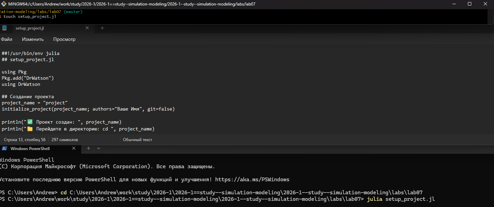

##

Создаем файл, где прописываем пакеты, необходимые для выполнения работы и запускаем его .

##

Создаем файл в папке scripts, реализуем в нем модель M/M/c, которая будет симулировать и анализровать входящие потоки, обслуживания их интенсивности и занятость приборов(каналов) на 10 клиентах(customers)и 2 серверах(каналах) 

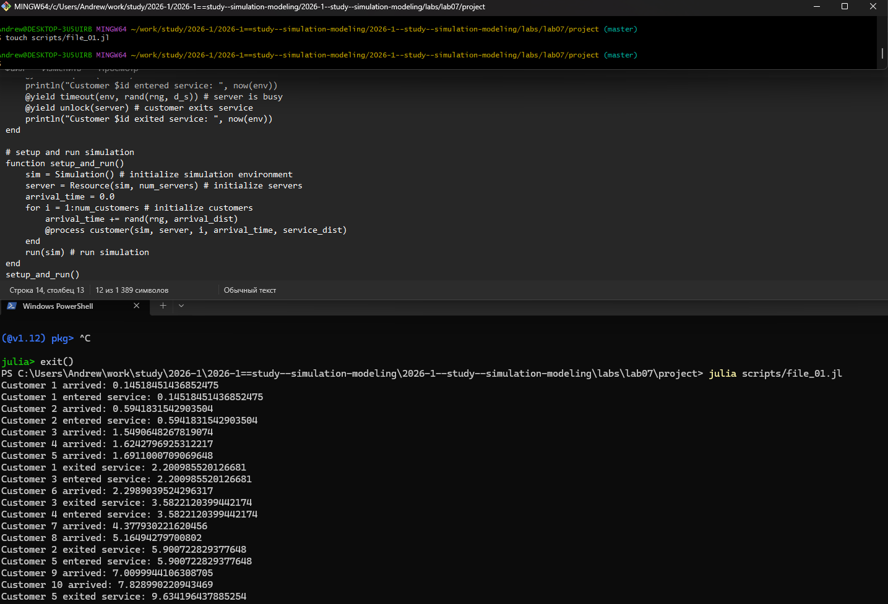

##

Преобразовываем код в произвольные стили и открываем один из них, чтобы убедиться в правильности компиляции  

##

Создаем файл, в котором добавляем графики: диаграмма обслуживания, кол-во клиентов в системе, время ожидания по клиентам  

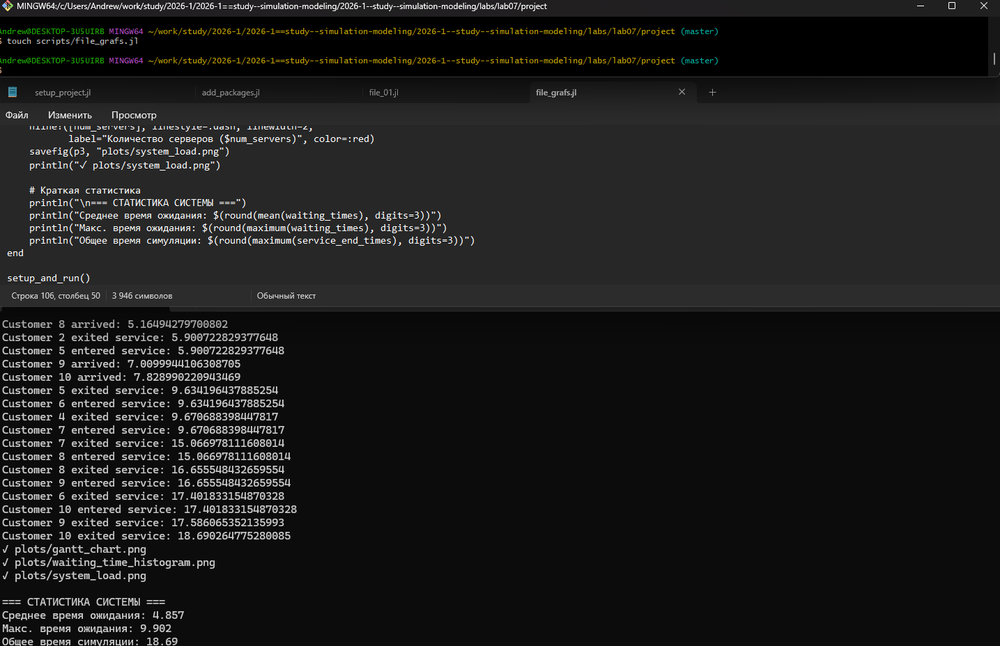

##

Первый график:диаграмма обслуживания - мы видим как система принимает клиентов и насколько долго обрабатывается каждый клиент

##

Второй график: кол-во клиентов в системе - мы видим как со временем меняется количество клиентов в системе, кто-то ждет, кто то уже обрабатывается сервером 

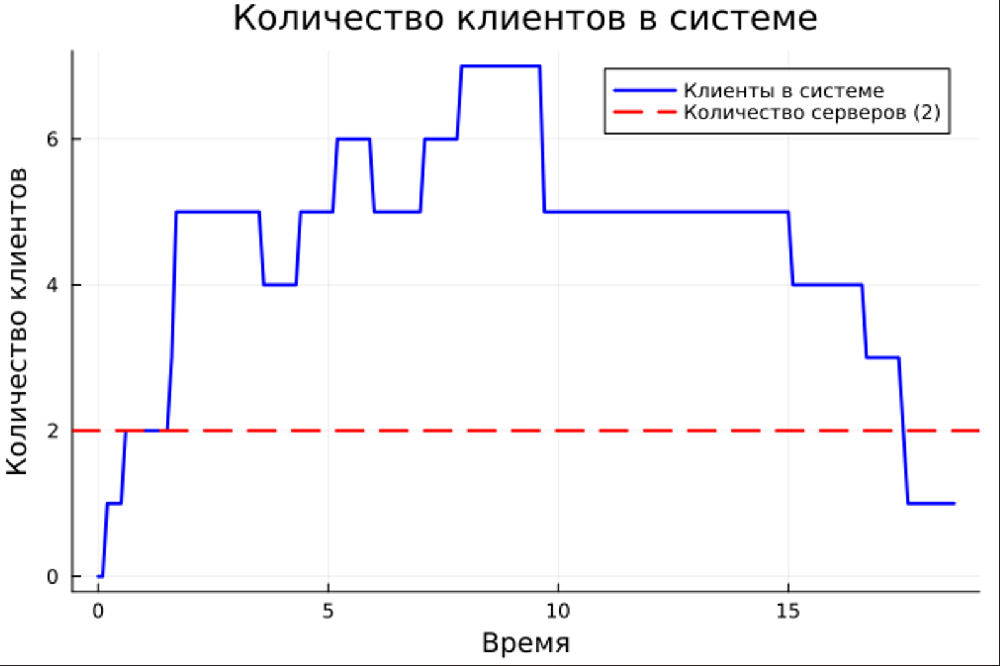

##

Третий график: время ожидания по клиентам - мы видим, как скапливаются клиенты, образуются очереди и сколько customers приходится ждать пока освободится сервер  

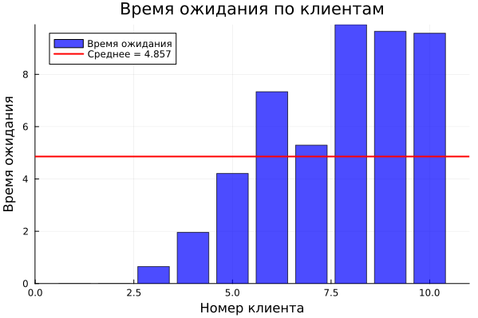

##

Преобразовываем код в произвольные стили и открываем один из них, чтобы убедиться в правильности компиляции  

##

Переходим в модель Росса, для начала реализуем обычные симуляции с параметрами (рабочие машины, запасные, время починки, время поломки и тд.) 

##

Преобразовываем код в произвольные стили и открываем один из них, чтобы убедиться в правильности компиляции   

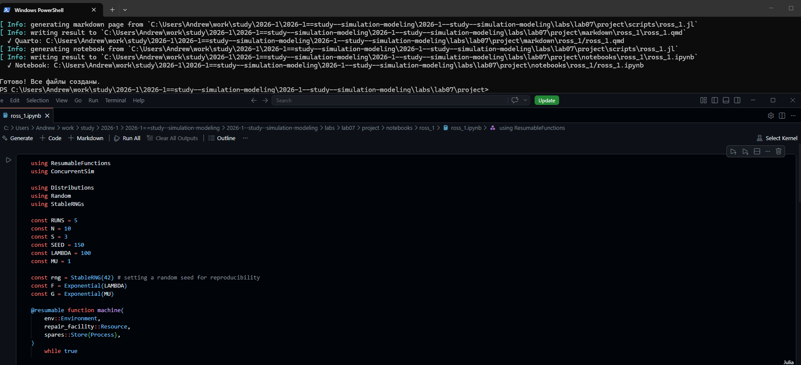

##

Преобразовываем код, добавляем ремонтников, я решил взять 5, как мы видим, время работы системы сильно увеличилось 

##

Преобразовываем код в произвольные стили и открываем один из них, чтобы убедиться в правильности компиляции  

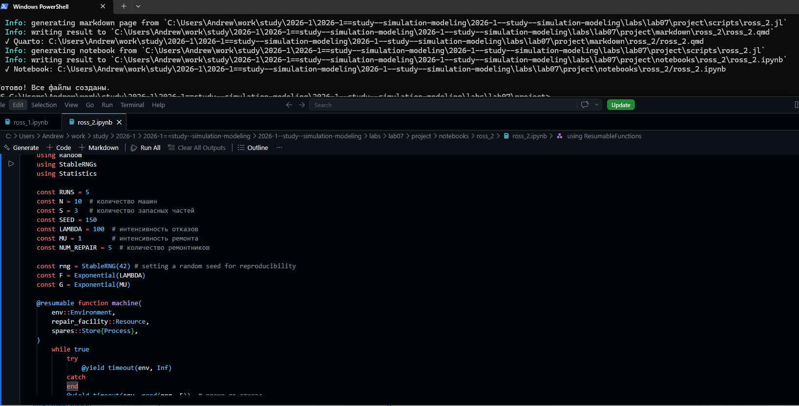

##

Теперь проводим симуляцию  с разным количество работающих машин(N=30), оставляем резерв таким же, как мы видим, система довольно быстро вышла из строя, что не удивительно   

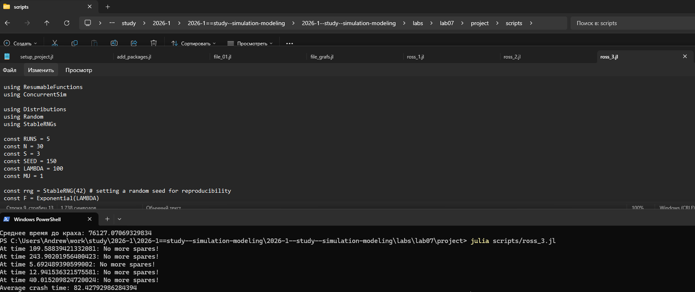

##

Преобразовываем код в произвольные стили и открываем один из них, чтобы убедиться в правильности компиляции   

##

Проводим мониторинг загрузки ремонтиника,средней длины очереди на ремонт   

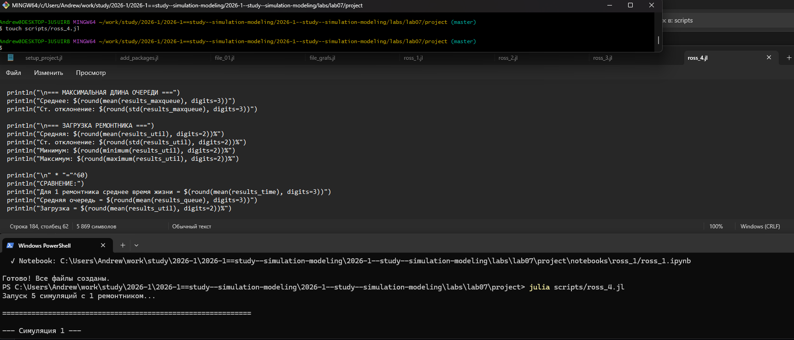

##

Преобразовываем код в произвольные стили и открываем один из них, чтобы убедиться в правильности компиляции   

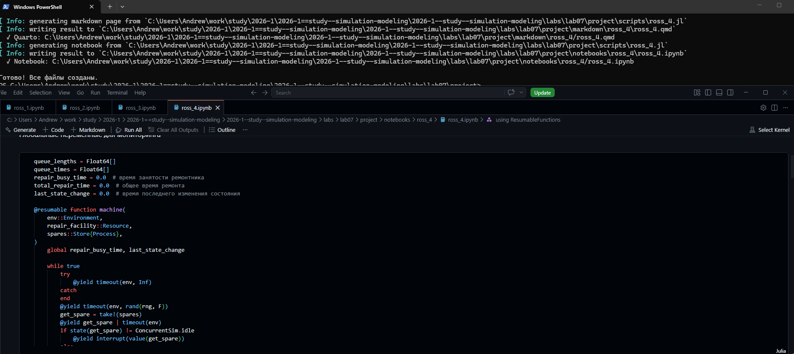

##

Создаем график изменения числа исправных машин во времени  

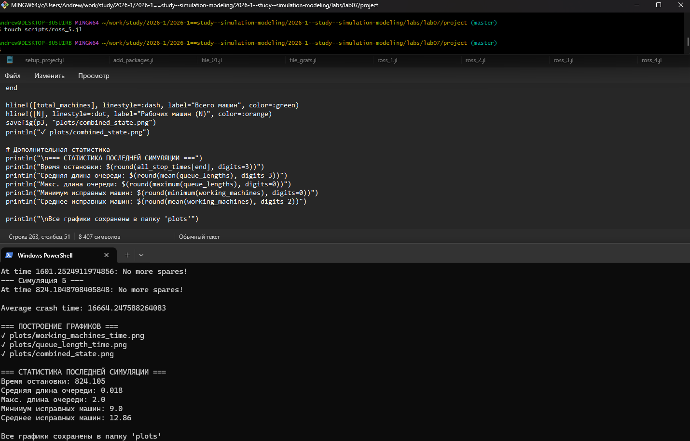

##

Как мы видим, очередь на ремонт большая и рано или поздно система встает (машина сломалась но её нельзя заменить резервной) 

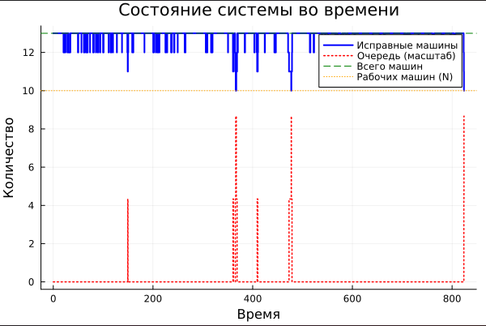

##

Преобразовываем код в произвольные стили и открываем один из них, чтобы убедиться в правильности компиляции  

# Выводы

## Выводы

В данной работе мы изучили и применили дискретно-событийное моделирование.

