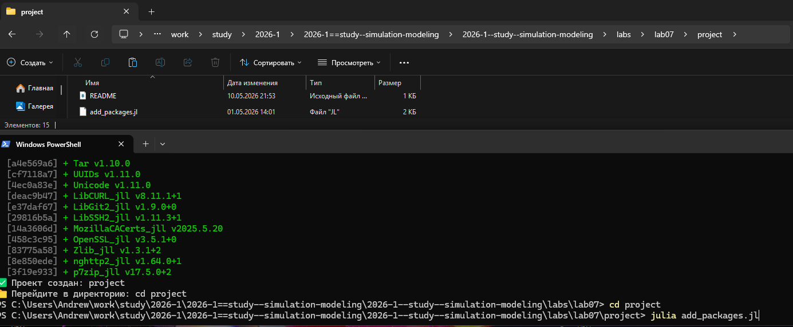
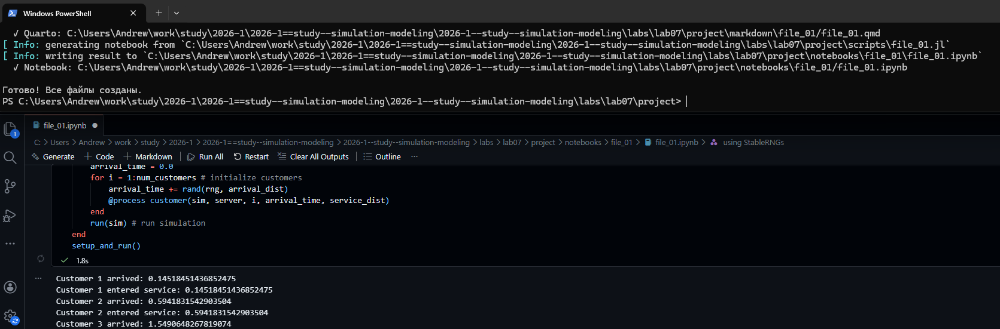
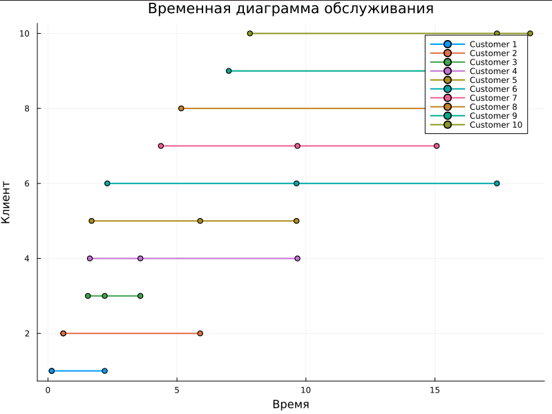
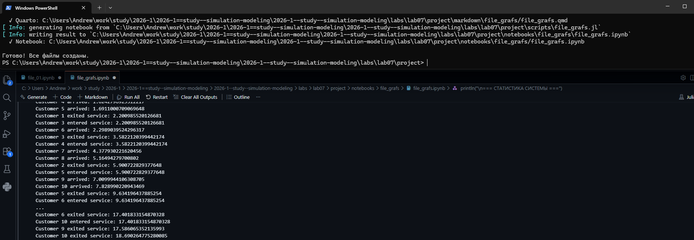
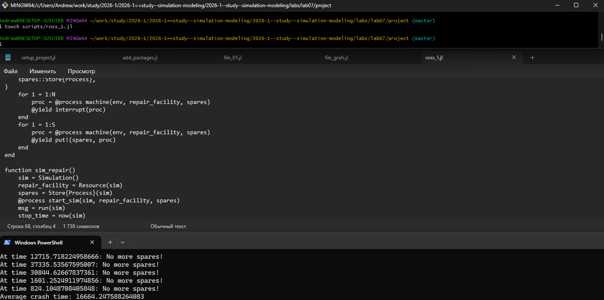
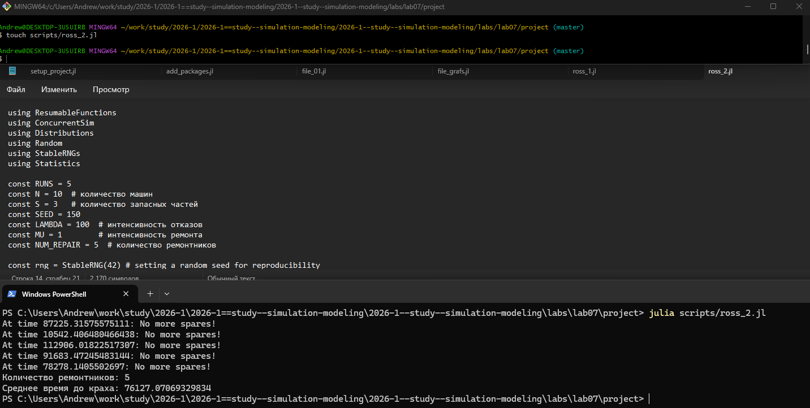
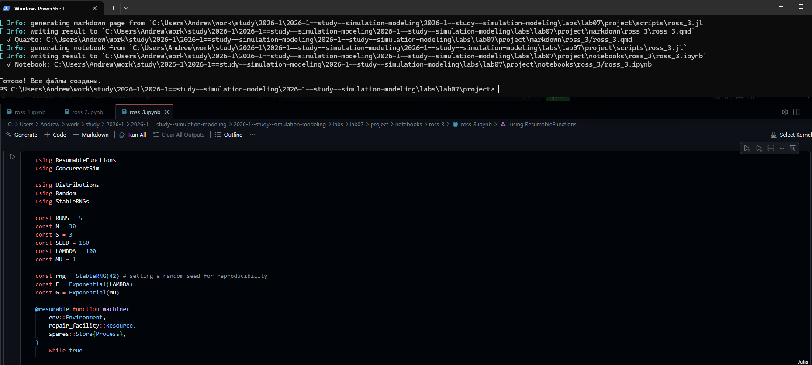
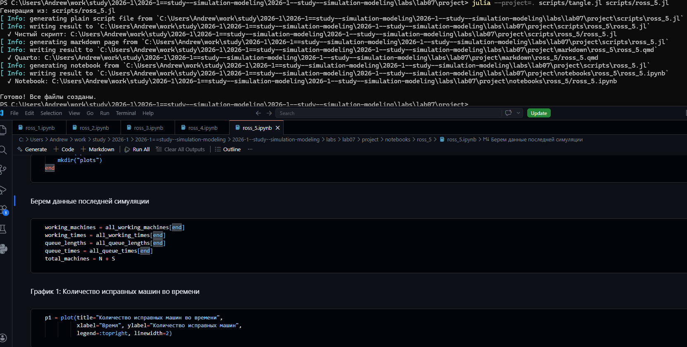

---
## Author
author:
  name: Андрей Геннадьевич Софич
  degrees: DSc
  orcid: 0000-0002-0877-7063
  email: safich05@mail.ru					
  affiliation:
    - name: Российский университет дружбы народов
      country: Российская Федерация
      postal-code: 117198
      city: Москва
      address: ул. Миклухо-Маклая, д. 6

## Title
title: "Лабораторная работа №7"
subtitle: "Дискретно-событийное моделирование"
license: "CC BY"
---

# Цель работы

Изучить основные модели теории массового обслуживания

# Задание

Применить модели на задачах, выполнить несколько различных симуляций.

# Выполнение лабораторной работы

Создаем рабочий каталог и инициализируем проект в julia ([рис. @fig-001]).

{#fig-001 width=70%}

Создаем файл, где прописываем пакеты, необходимые для выполнения работы и запускаем его ([рис. @fig-002]).

{#fig-002 width=70%}

Создаем файл в папке scripts, реализуем в нем модель M/M/c, которая будет симулировать и анализровать входящие потоки, обслуживания их интенсивности и занятость приборов(каналов) на 10 клиентах(customers)и 2 серверах(каналах) ([рис. @fig-003]).

{#fig-003 width=70%}

Преобразовываем код в произвольные стили и открываем один из них, чтобы убедиться в правильности компиляции   ([рис. @fig-004]).

{#fig-004 width=70%}

Создаем файл, в котором добавляем графики: диаграмма обслуживания, кол-во клиентов в системе, время ожидания по клиентам  ([рис. @fig-005]).

{#fig-005 width=70%}

Первый график:диаграмма обслуживания - мы видим как система принимает клиентов и насколько долго обрабатывается каждый клиент ([рис. @fig-006]).

{#fig-006 width=70%}

Второй график: кол-во клиентов в системе - мы видим как со временем меняется количество клиентов в системе, кто-то ждет, кто то уже обрабатывается сервером ([рис. @fig-007]).

{#fig-007 width=70%}

Третий график: время ожидания по клиентам - мы видим, как скапливаются клиенты, образуются очереди и сколько customers приходится ждать пока освободится сервер  ([рис. @fig-008]).

{#fig-008 width=70%}

Преобразовываем код в произвольные стили и открываем один из них, чтобы убедиться в правильности компиляции   ([рис. @fig-009]).

{#fig-009 width=70%}

Переходим в модель Росса, для начала реализуем обычные симуляции с параметрами (рабочие машины, запасные, время починки, время поломки и тд.) ([рис. @fig-010]).

{#fig-010 width=70%}

Преобразовываем код в произвольные стили и открываем один из них, чтобы убедиться в правильности компиляции   ([рис. @fig-011]).

{#fig-011 width=70%}

Преобразовываем код, добавляем ремонтников, я решил взять 5, как мы видим, время работы системы сильно увеличилось ([рис. @fig-012]).

{#fig-012 width=70%}

Преобразовываем код в произвольные стили и открываем один из них, чтобы убедиться в правильности компиляции   ([рис. @fig-013]).

{#fig-013 width=70%}

Теперь проводим симуляцию  с разным количество работающих машин(N=30), оставляем резерв таким же, как мы видим, система довольно быстро вышла из строя, что не удивительно   ([рис. @fig-014]).

{#fig-014 width=70%}

Преобразовываем код в произвольные стили и открываем один из них, чтобы убедиться в правильности компиляции   ([рис. @fig-015]).

{#fig-015 width=70%}

Проводим мониторинг загрузки ремонтиника,средней длины очереди на ремонт   ([рис. @fig-016]).

{#fig-016 width=70%}

Преобразовываем код в произвольные стили и открываем один из них, чтобы убедиться в правильности компиляции   ([рис. @fig-017]).

{#fig-017 width=70%}

Создаем график изменения числа исправных машин во времени  ([рис. @fig-018]).

{#fig-018 width=70%}

Как мы видим, очередь на ремонт большая и рано или поздно система встает (машина сломалась но её нельзя заменить резервной)  ([рис. @fig-019]).

{#fig-019 width=70%}

Преобразовываем код в произвольные стили и открываем один из них, чтобы убедиться в правильности компиляции   ([рис. @fig-020]).

{#fig-020 width=70%}

**Для первого прогона модели M/M/c**



**Построения графиков M/M/c**



**Первый прогон модели Росса**



**Прогон модели Росса для 5 ремонтников**



**Прогон для 30 машин**



**Прогон для загрузки ремонтника**



**Добавление графика изменения числа машин во времени**



# Выводы

В данной работе мы изучили и применили дискретно-событийное моделирование.

