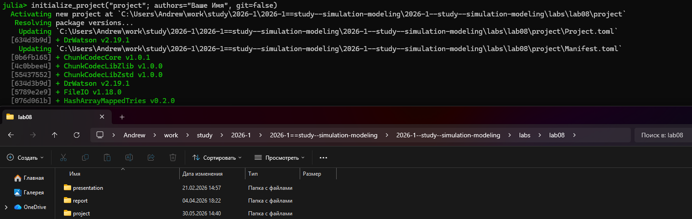
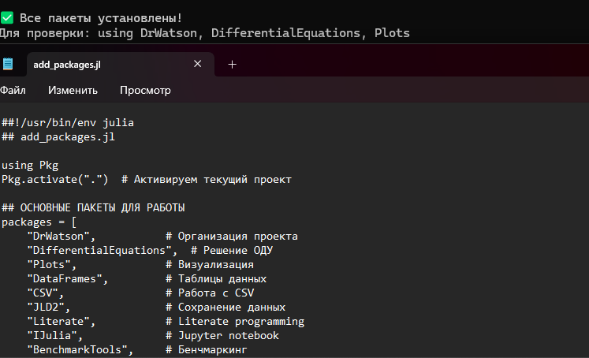
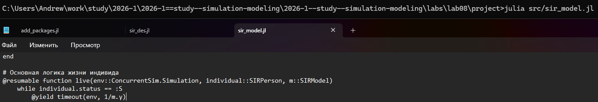
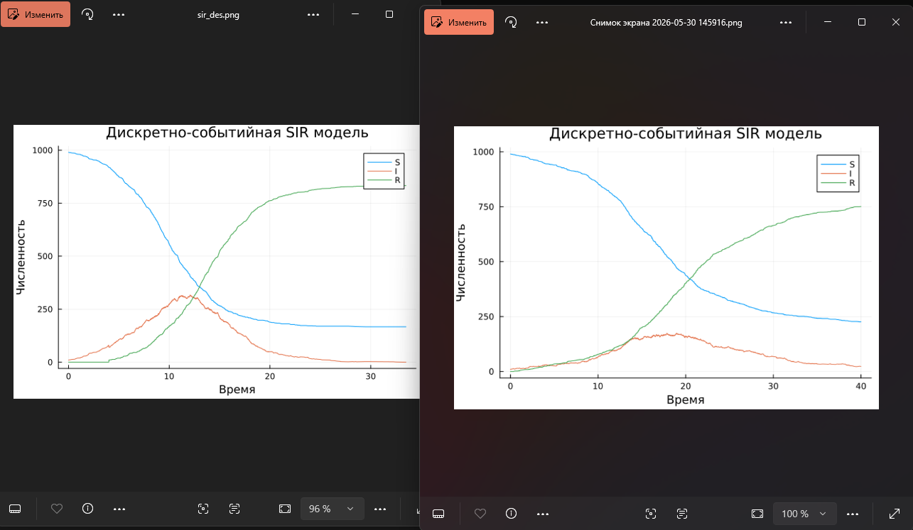
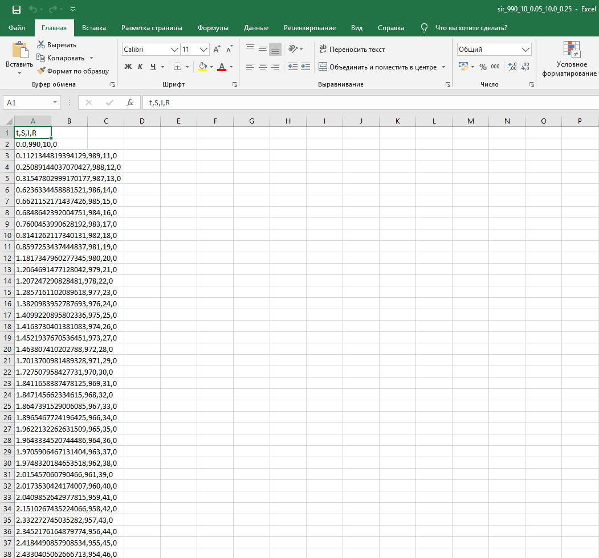
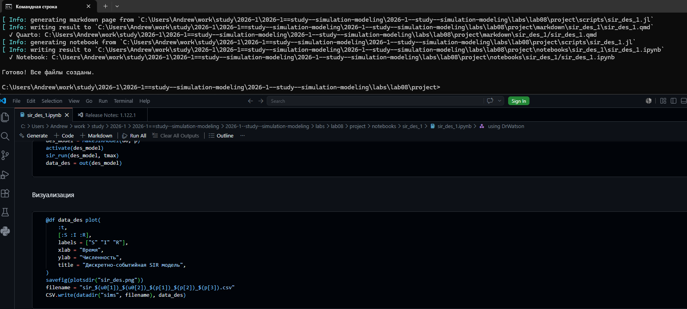

---
## Author
author:
  name: Софич Андрей Геннадьевич
  degrees: DSc
  orcid: 0000-0002-0877-7063
  email: safich05@mail.ru
  affiliation:
    - name: Российский университет дружбы народов
      country: Российская Федерация
      postal-code: 117198
      city: Москва
      address: ул. Миклухо-Маклая, д. 6
## Title
title: Лабораторная работа №8
subtitle: Реализация основных моделей в дискретно-событийном подходе
license: CC BY
date: today
date-format: "2026-30-05" # Example: 2025-09-06
---
## Докладчик

:::::::::::::: {.columns align=center}
::: {.column width="70%"}

  * Софич Андрей Геннадьевич

:::
::: {.column width="30%"}

:::
::::::::::::::

# Актуальность

## Актуальность

Изучить дискретно-событийный подход к имитационному моделированию на примере классической модели распространения инфекции SIR. 

# Цель

## Цели и задачи

Реализовать стохастическую дискретно-событийную модель в виде программного комплекса на языке Julia. Провести анализ влияния параметров, сравнить со стохастической и детерминированной версиями, оценить производительность и модифицировать модель

# Выполнение лабораторной работы

## Выполнение лабораторной работы

Создаем рабочий каталог и инициализируем проект в julia 

##

Создаем файл, где прописываем пакеты, необходимые для выполнения работы и запускаем его 

##

Создаем файл в папке src, реализуем в нем модель SIR, определяем структуру данных, входные данные, прописываем функции мутации масивов статистики 

##

Прописываем и запускаем скрипт запуска, прописываем начальные параметры и запускаем симуляцию 

##

Получаем результаты, на которых отлично видно структуру поведения агентов: восприимчивый-зараженный-выздоровевший  

##

Преобразовываем код в произвольные стили и открываем один из них, чтобы убедиться в правильности компиляции  

##

Заменяем экспоненциальное время выздоровления на фиксированную величину 1/γ в файле src 

##

Запускаем файл симуляции и смотрим на результаты до и после, отсутсвуют хвосты распределения и выздоровлее стало более синхронным  

##

Добавляем возможность получать статистические данные в виде таблицы  

##

Проверяем таблицу с данными 

##

Преобразовываем код в произвольные стили и открываем один из них, чтобы убедиться в правильности компиляции  

# Выводы

## Выводы

В данной работе мы изучили и применили дискретно-событийное моделирование.

