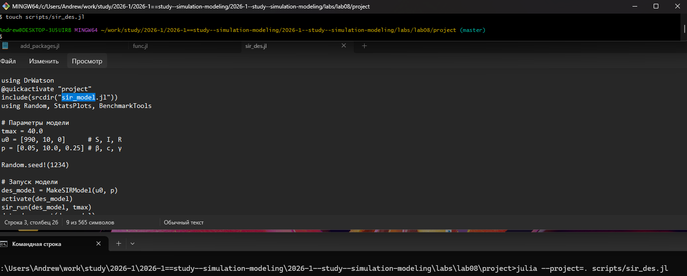
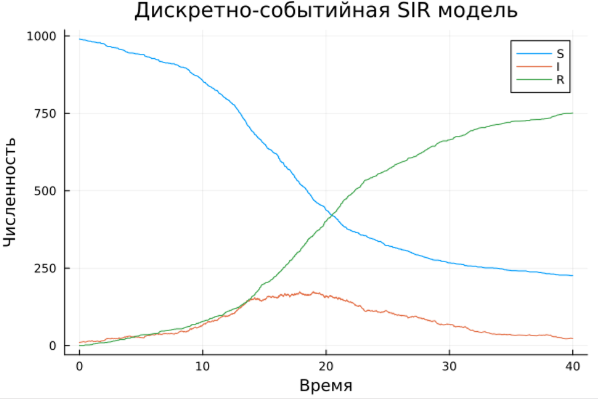
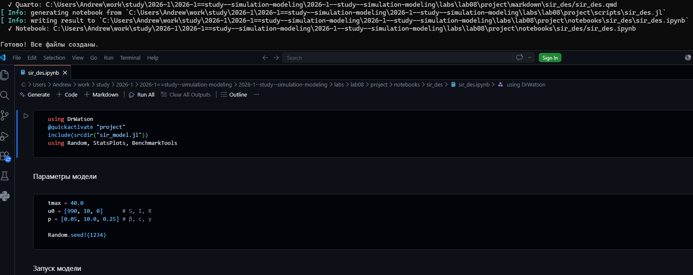
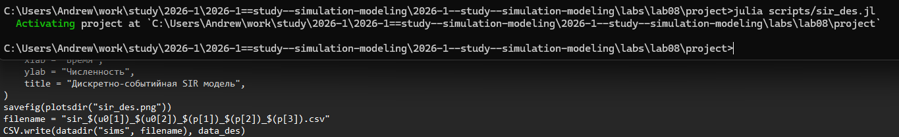

---
## Author
author:
  name: Андрей Геннадьевич Софич
  degrees: DSc
  orcid: 0000-0002-0877-7063
  email: safich05@mail.ru					
  affiliation:
    - name: Российский университет дружбы народов
      country: Российская Федерация
      postal-code: 117198
      city: Москва
      address: ул. Миклухо-Маклая, д. 6

## Title
title: "Лабораторная работа №8"
subtitle: "Реализация основных моделей в дискретно-событийном подходе"
license: "CC BY"
---

# Цель работы

Изучить дискретно-событийный подход к имитационному моделированию на примере классической модели распространения инфекции SIR. 

# Задание

Реализовать стохастическую дискретно-событийную модель в виде программного комплекса на языке Julia. Провести анализ влияния параметров, сравнить со стохастической и детерминированной версиями, оценить производительность и модифицировать модель.

# Выполнение лабораторной работы

Создаем рабочий каталог и инициализируем проект в julia ([рис. @fig-001]).

{#fig-001 width=70%}

Создаем файл, где прописываем пакеты, необходимые для выполнения работы и запускаем его ([рис. @fig-002]).

{#fig-002 width=70%}

Создаем файл в папке src, реализуем в нем модель SIR, определяем структуру данных, входные данные, прописываем функции мутации масивов статистики ([рис. @fig-003]).

{#fig-003 width=70%}

Прописываем и запускаем скрипт запуска, прописываем начальные параметры и запускаем симуляцию  ([рис. @fig-004]).

{#fig-004 width=70%}

Получаем результаты, на которых отлично видно структуру поведения агентов: восприимчивый-зараженный-выздоровевший  ([рис. @fig-005]).

{#fig-005 width=70%}

Преобразовываем код в произвольные стили и открываем один из них, чтобы убедиться в правильности компиляции   ([рис. @fig-006]).

{#fig-006 width=70%}

Заменяем экспоненциальное время выздоровления на фиксированную величину 1/γ в файле src ([рис. @fig-007]).

{#fig-007 width=70%}

Запускаем файл симуляции и смотрим на результаты до и после, отсутсвуют хвосты распределения и выздоровлее стало более синхронным  ([рис. @fig-008]).

{#fig-008 width=70%}

Добавляем возможность получать статистические данные в виде таблицы   ([рис. @fig-009]).

{#fig-009 width=70%}

Проверяем таблицу с данными ([рис. @fig-010]).

{#fig-010 width=70%}

Преобразовываем код в произвольные стили и открываем один из них, чтобы убедиться в правильности компиляции   ([рис. @fig-011]).

{#fig-011 width=70%}





# Выводы

В данной работе мы изучили и применили дискретно-событийное моделирование.

