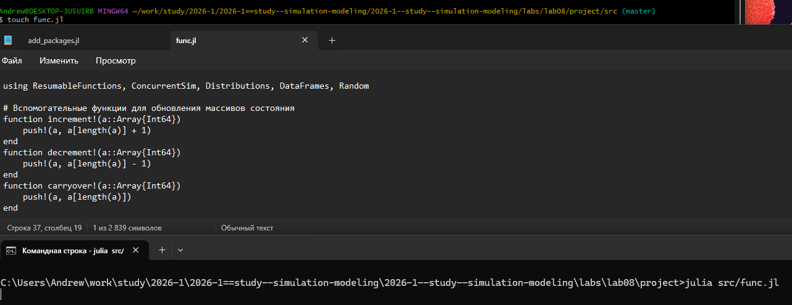

---
## Author
author:
  name: Андрей Геннадьевич Софич
  degrees: DSc
  orcid: 0000-0002-0877-7063
  email: safich05@mail.ru					
  affiliation:
    - name: Российский университет дружбы народов
      country: Российская Федерация
      postal-code: 117198
      city: Москва
      address: ул. Миклухо-Маклая, д. 6

## Title
title: "Лабораторная работа №2"
subtitle: "Основные модели: SIR и модель Лотки-Вольтерры"
license: "CC BY"
---

# Цель работы

Познакомиться с базовым arduino uno

# Задание

В этом эксперименте мы научимся управлять светодиодом. Заставим его мигать.

# Теоритическая часть

Необходимые компоненты:
•контроллер Arduino UNO R3;
•плата для прототипирования Breadboard;
•светодиод;
•резистор 220 Ом;
•провода Male-Male (папа-папа).

Светодиод – это полупроводниковый прибор, преобразующий электрический ток непосредственно в световое излучение.
По-английски светодиод называется light emitting diode, или LED. Цветовые характеристики светодиодов зависят от химического состава использованного в нем полупроводника. Светодиод излучает в узкой части спектра, его цвет чист, что особенно ценят дизайнеры. Светодиод механически прочен и исключительно надежен, его срок службы может достигать 100 тысяч часов, что почти в 100 раз больше, чем у лампочки накаливания, и в 5–10 раз больше, чем у люминесцентной лампы. Наконец, светодиод – низковольтный электроприбор, а стало быть, безопасный. Светодиоды поляризованы, имеет значение, в каком направлении подключать их. Положительный вывод светодиода (более длинный) называется анодом, отрицательный – катодом. Как и все диоды, светодиоды позволяют току течь только в одном направлении – от анода к катоду. Поскольку ток протекает от положительного к отрицательному, анод светодиода должен быть подключен к цифровому сигналу 5 В, а катод должен быть подключен к земле. Мы будем подключать светодиод к цифровому контакту D10 Arduino последовательно с резистором. Светодиоды должны быть всегда соединены последовательно с резистором, который выступает в качестве ограничителя тока. Чем больше значение резистора, тем больше он ограничивает ток. В этом эксперименте мы используем резистор номиналом 220 Ом.

# Выполнение лабораторной работы

Подключаем светодиод в плату для прототипирования ([рис. @fig-001]).

{#fig-001 width=70%}

Устанавливаем резистор, сопротивлением 220 ом в плату ([рис. @fig-002]).

{#fig-002 width=70%}

Длинную ножку светодиода (анод) подключаем к цифровому выводу D10 Arduino, другую (катод) – через  резистор 220 Ом к выводу GND ([рис. @fig-003]).

{#fig-003 width=70%}

Загружаем скетч  в плату Arduino  

const int LED=10; // вывод для подключения светодиода 10 (D10)
void setup()
{
// Конфигурируем вывод подключения светодиода как выход (OUTPUT)
pinMode(LED, OUTPUT);
}
void loop()
{
// включаем светодиод, подавая на вывод 1 (HIGH)
digitalWrite(LED,HIGH);
// пауза 1 сек (1000 мс)
delay(1000);
// выключаем светодиод, подавая на вывод 0 (LOW)
digitalWrite(LED,LOW);
// пауза 1 сек (1000 мс)
delay(1000);
} 

Для мигания светодиода необходимо попеременно c определенным интервалом подавать на вывод Arduino сигналы HIGH (высокий уровень или 1) и LOW (низкий уровень или 0). Интервал изменения сигнала на выходе D10 Arduino будем устанавливать с помощью команды delay(), задерживающей выполнение скетча на заданное время в миллисекундах (мс).

Проверяем, получилось ли у нас успешно выполнить эксперимент.

# Выводы

В данной работе мы научились управлять светодиодом.

